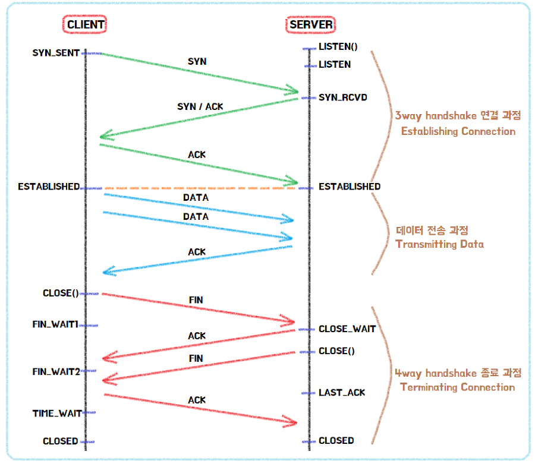

## 네트워크

### OSI 7 계층

통신 과정을 7단계로 나눈 국제 통신 표준 규약

각 통신 과정들을 단계를 나눔으로서 계층간의 독립성을 확보할 수 있다.

따라서 통신과정에 이상이 발생하면 이상이 있는 계층에 대해서만 작업을 수행하고 다른 계층은 영향을 받지 않기 때문에 디버깅이나 유지관리가 수월하다는 장점

7 계층(응용 계층): 사용자와 직접 상호작용하는 응용 프로그램들이 포함된 계층. HTTP, FTP, DNS 프로토콜 사용
6 계층(표현 계층): 데이터의 형식(Format)을 정의하는 계층. 파일을 인코딩하거나 명령어를 포장, 압축, 암호화 함
5 계층(세션 계층): 컴퓨터끼리 통신을 하기 위해 세션을 만드는 계층. 통신 시스템 사용자간의 연결을 유지 및 설정
4 계층(전송 계층): 최종 수신 프로세스로 데이터의 전송을 담당하는 계층. 양쪽간 신뢰성있는 데이터를 주고 받도록 흐름 제어나 중복검사, 오류 검출 및 복구와 같은 기능. TCP, UDP 프로토콜
3 계층(네트워크 계층): 패킷을 목적지까지 가장 빠른 길로 전송하기 위한 계층. 흐름제어, 세그멘테이션, 오류 제어, 인터네트워킹 등을 수행
2 계층(데이터링크 계층): 데이터의 물리적인 전송과 에러 검출, 흐름 제어를 담당하는 계층. 데이터 전송이 프레임 단위로 이뤄지며 MAC 주소를 통해 통신함
1 계층(물리 계층): 데이터를 전기 신호로 바꾸어주는 계층. 데이터를 전달하기만 할 뿐 그 외의 기능들에는 관여하지 않음

1. 1계층 : 물리계층(Physical Layer)

- 데이터를 전기 신호로 바꿔서 와이어에 실어주는 계층
- 장비 : 리피터(전기신호를 증폭), 허브
- 단위 :Bit

2. 2계층 : 데이터링크 계층(Data Link Layer)

- P2P 간 신뢰성있는 전송을 보장하기 위한 계층으로 CRC 기반의 오류 제어와 흐름 제어가 필요
- 주소값은 MAC Address를 물리적으로 할당받으며, NIC(=LAN카드)가 만들어질때부터 고유 일련번호가 있다.(사설 IP는 중복 가능)
- 단위 : Frame
- 장비 : Bridge, L2 Switch(중요)
- 프로토콜 : 이더넷(중요), HDLC

3. 3계층 : 네트워크 계층(Network Layer)

- IP주소 기반으로 경로를 찾아주는 계층
- 라우터를 통해 이동할 경로를 선택하여 IP 주소를 지정하고, 해당 경로에 따라 패킷을 전달
- 라우팅, 흐름 제어, 오류 제어, 세그멘테이션 등을 수행
- 단위 : Packet
- 프로토콜 : IP, RIP, ARP, ICMP
- 장비 : Router(L3 Switch)

4. 4계층 : 전송 계층(Transport Layer)

- TCP, UDP 등의 프로토콜을 통해 통신을 활성화
- 포트를 열어두고, 프로그램들이 전송할 수 있도록 제공
- 오류검출 및 복구, 흐름 제어, 중복검사 등 수행
- Port기반 데이터 세그먼트 전송
- 단위 : Segment(TCP) / Datagram(UDP)
- 프로토콜 : TCP / IP
- 장비 : 게이트웨이

5. 5계층 : 세션 계층(Session Layer)

- TCP/IP 세션을 만들고 없애는 책임을 지니고 있다.
- 세션 설정, 유지, 종료, 전송 중단시 복구 등의 기능이 있다.
- Ex) API, Socket

6. 6계층 : 표현 계층(Presentation) 계층

- 데이터 표현에 대한 독립성을 제공하고 암호화하는 역할
- 파이
- Ex) JPEG, MPEG 등
  사용자의 명령어를 완성 및 결과 표현. 포장/압축/암호화

7. 응용(Application) 계층

- 일반적인 응용 서비스를 수행한다.
- 사용자 인터페이스, 전자우편, 데이터베이스 관리 등의 서비스를 제공한다.
- HTTP, FTP, SMTP, IMAP, Telnet 등

### 3 Way-Handshake & 4 Way-Handshake

3-Way Handshake 는 TCP의 접속, 4-Way Handshake는 TCP의 접속 해제 과정

TCP 3 Way Handshake는 TCP/IP프로토콜을 이용해서 통신을 하는 응용프로그램이 데이터를 전송하기 전에 먼저 정확한 전송을 보장하기 위해 상대방 컴퓨터와 사전에 세션을 수립하는 과정을 의미

송신자와 수신자는 총 3번에 걸쳐 데이터를 주고 받으며 통신이 가능한 상태임을 확인한다.

양쪽 모두 상대편에 대한 초기 순차일련변호를 얻을 수 있도록 한다.

Client > Server : TCP SYN

Server > Client : TCP SYN, ACK

Client > Server : TCP ACK

여기서 SYN은 'synchronize sequence numbers', 그리고 ACK는'acknowledgment' 의 약자

[STEP 1]

A클라이언트는 B서버에 접속을 요청하는 SYN 패킷을 보낸다.

이때 A클라이언트는 SYN 을 보내고 SYN/ACK 응답을 기다리는 SYN_SENT 상태, B서버는 Wait for Client 상태이다.

[STEP 2]

B서버는 SYN요청을 받고 A클라이언트에게 요청을 수락한다는 ACK 와 SYN flag 가 설정된 패킷을 발송하고

A가 다시 ACK으로 응답하기를 기다린다. 이때 B서버는 SYN_RECEIVED 상태가 된다.

[STEP 3]

A클라이언트는 B서버에게 ACK을 보내고 이후로부터는 연결이 이루어지고 데이터가 오가게 되는것이다. 이때의 B서버 상태가 ESTABLISHED 이다.

3-Way handshake는 TCP의 연결을 초기화 할 때 사용한다면, 4-Way handshake는 세션을 종료하기 위해 수행되는 절차

[STEP 1]

클라이언트가 연결을 종료하겠다는 FIN플래그를 전송한다. 이때 A클라이언트는 FIN-WAIT 상태가 된다.

[STEP 2]

B서버는 FIN플래그를 받고, 일단 확인메시지 ACK 보내고 자신의 통신이 끝날때까지 기다리는데 이 상태가 B서버의 CLOSE_WAIT상태다.

[STEP 3]

연결을 종료할 준비가 되면, 연결해지를 위한 준비가 되었음을 알리기 위해 클라이언트에게 FIN플래그를 전송한다. 이때 B서버의 상태는 LAST-ACK이다.

[STEP 4]

클라이언트는 해지준비가 되었다는 ACK를 확인했다는 메시지를 보낸다.

A클라이언트의 상태가 FIN-WAIT ->TIME-WAIT 으로 변경된다.

그런데 만약 "Server에서 FIN을 전송하기 전에 전송한 패킷이 Routing 지연이나 패킷 유실로 인한 재전송 등으로 인해 FIN패킷보다 늦게 도착하는 상황"이 발생한다면 어떻게 되나?

Client에서 세션을 종료시킨 후 뒤늦게 도착하는 패킷이 있다면 이 패킷은 Drop되고 데이터는 유실될 것입니다.

A클라이언트는 이러한 현상에 대비하여 Client는 Server로부터 FIN을 수신하더라도 일정시간(디폴트 240초) 동안 세션을 남겨놓고 잉여 패킷을 기다리는 과정을 거치게 되는데 이 과정을 "TIME_WAIT" 라고 한다. 일정시간이 지나면, 세션을 만료하고 연결을 종료시키며, "CLOSE" 상태로 변화한다.

### TCP / UDP

모두 전송계층에서 사용되는 프로토콜

전송계층은 프로토콜 내에서 송신자와 수신자를 연결하는 통신 서비스를 제공하는 계층인데,

IP에 의해 전달되는 패킷의 오류를 검사하고 재전송 요구 등의 제어를 담당

TCP(Transmission Control Protocol)

TCP는 신뢰성 있는 데이터 전송을 지원하는 연결 지향형 프로토콜

일반적으로 TCP와 IP가 함께 사용되는데, IP가 데이터의 전송을 처리한다면 TCP는 패킷 추적 및 관리를 함

연결 지향형인 TCP는 3-way handshaking이라는 과정을 통해 연결 후 통신을 시작하는데, 흐름 제어와 혼잡 제어를 지원하며 데이터의 순서를 보장한다.

---

흐름 제어: 보내는 측과 받는 측의 데이터 처리속도 차이를 조절해주는 것

혼잡 제어: 네트워크 내의 패킷 수가 넘치게 증가하지 않도록 방지하는 것

---

특징

연결형 서비스로 가상 회선 방식을 제공
데이터의 전송 순서 보장

데이터의 경계를 구분하지 않음 - 스트림 데이터(나와 상대방 사이에서 tcp가 흐름 제어를 계속하면서 연결을 유지. 연결이 유지되므로 더 이상 주고받을 데이터가 없다면 연결 끊기)

신뢰성 있는 데이터 전송

UDP보다 전송속도가 느림

연결을 설정(3-way handshaking)과 해제(4-way handshaking)

UDP(User Datagram Protocol)

UDP는 비연결형 프로토콜로써, 인터넷상에서 서로 정보를 주고받을 때 정보를 보낸다는 신호나 받는다는 신호 절차를 거치지 않고 보내는 쪽에서 일방적으로 데이터를 전달하는 통신 프로토콜

TCP와는 다르게 연결 설정이 없으며, 혼잡 제어를 하지 않기 때문에 TCP보다 전송 속도가 빠름

그러나 데이터 전송에 대한 보장을 하지 않기 때문에 패킷 손실이 발생할 수 있다

특징

비연결형 서비스로 데이터그램 방식을 제공

비신뢰성

데이터의 경계를 구분 - 패킷 단위(udp/ip는 상대방에게 미리 허락을 구하지 않고 그냥 보내고 tcp처럼 상대방과의 흐름 제어가 없어서 데이터를 보내면 udp는 수신하는 쪽에서 한 번에 모두 받을 수 있도록 처리. 그래서 udp 프로토콜의 이름이 user datagram protocol입니다. 사용자가 보내는 데이터 패킷 그대로 상대방이 받을 수 있게 하는 프로토콜)

패킷 오버해드가 적어 네트워크 부하 감소

혼잡 제어를 하지 않기 때문에 TCP보다 빠름

TCP의 handshaking 같은 연결 설정이 없음

### GET vs POST

사용 목적 : GET은 서버의 리소스에서 데이터를 요청할 때, POST는 서버의 리소스를 새로 생성/업데이트 시 사용

요청에 body 유무 : GET은 URL 파라미터에 요청하는 데이터를 담아 보내기 때문에 HTTP message에 body가 없으며, POST는 body에 데이터를 담아 보내기 때문에 HTTP message에 body가 존재

멱등성(idempotent) : GET은 리소스를 조회한다는 점에서 여러 번 요청하더라도 응답이 똑같기 때문에 멱등이며, POST는 리소스 생성/업데이트 용도이기 때문에 멱등이 아니다.

GET, PUT, DELETE가 멱등하다.
POST 멱등X.
PATCH는 멱등성 항상 보장X (PUT은 요청에 대하여 리소스를 통째로 바꿔버리기 때문에 멱등성이 보장되지만, PATCH는 리소스의 일부에 대하여 변화를 명령할 수 있기 때문)

### PUT vs PATCH

PUT : 자원의 전체 교체, 자원 교체시 모든 필드 필요 (만약 전체가 아닌 일부만 전달할 경우, 전달한 필드 외 모두 null or 초기값 처리되니 주의)

PATCH : 자원의 부분교체, 자원 교체시 일부 필드 필요

### HTTP vs HTTPS

HTTP는 Hypertext Transfer Protocol의 약자로 서로 다른 시스템들 사이에서 통신을 주고받게 해주는 가장 기초적인 통신 규약

HTTP는 기본적으로 평문 데이터 전송을 원칙으로 하기 때문에 개인의 프라이버시가 오가는 서비스들(전자상거래, 전자메일, 사내 문서 등)에 사용하기 부적합

네트워크에서 신호를 가로채 본다면 내용이 노출된다

기존 HTTP가 위변조에 취약하다는 점을 보완하기 위해 암호화나 인증 구조를 더한 것을 HTTPS(HTTP Secure)

HTTPS는 HTTP의 기능에 TLS(Transport Layer Security) 혹은 SSL(Secure Sockets Layer)을 사용하여 암호화된 버전

SSL 인증서란? SSL 프로토콜에 사용되는 인증서, 클라이언트가 접속한 서버가 신뢰할 수 있는 서버임을 보증하고 통신에 사용할 공개키를 클라이언트에 전달

### DNS

도메인은 웹 브라우저를 통해 특정 사이트에 진입을 할 때, IP 주소를 대신하여 사용하는 주소

DNS는 DNS는 Domain Name System의 줄임말로, 데이터베이스 시스템

호스트의 도메인 이름을 IP 주소로 변환하거나 반대의 경우를 수행할 수 있도록 개발된 데이터베이스 시스템

DNS(Domain Name System)는 범국제적 단위로 웹사이트의 IP 주소와 도메인 주소를 이어주는 환경/시스템

DNS 시스템 안에서 이어주는 역할을 하는 서버를 풀네임으로 DNS 서버

네트워크 상에 존재하는 모든 PC는 IP 주소가 있다.
그러나 모든 IP 주소가 도메인 이름을 가지는 것은 아니다.
로컬 PC를 나타내는 127.0.0.1 은 localhost 로 사용할 수 있지만, 그 외의 모든 도메인 이름은 일정 기간 동안 대여하여 사용한다

브라우저의 검색창에 도메인 이름을 입력하여 해당 사이트로 이동하기 위해서는, 해당 도메인 이름과 매칭된 IP 주소를 확인하는 작업이 반드시 필요. 네트워크에는 이것을 위한 서버가 별도로 있다. 이 서버가 바로 DNS 서버

브라우저의 검색창에 naver.com을 입력한다.
이 요청은 DNS에서 IP 주소(125.209.222.142)를 찾는다.
그리고 이 IP 주소에 해당하는 웹 서버로 요청을 전달하여 클라이언트와 서버가 통신할 수 있도록 한다

### DNS RoundRobin

DNS 로드밸런싱은 별도의 하드웨어 장비나, 소프트웨어 없이 사용자가 DNS를 이용하여 도메인 정보를 조회하는 시점에서 트래픽을 분산하는 기법

DNS Load Balancing 기법 중에 Round robin 방식은 부하 분산의 대표적인 알고리즘인데, 순서대로 돌아가면서 (보통 시간 단위) 각각의 서버로 트래픽을 분산시켜서 처리하는 알고리즘

장점

- 중간 장비(로드밸런서 등) 없이도 서비스가 가능하다.
- 간편하다.

단점

- 서버의 수 만큼 공인 IP 주소가 필요하다.
- 서버에 장애가 발생해도 감지하지 않고 부하를 분산시킨다.
- 일반적인 로드밸런싱은 Health check를 수반한다. 라운드 로빈 DNS는 별도로 Health check를 하지 않는다.
- DNS 결과를 Caching해서 재사용하기 때문에 균등한 분산이 어렵다.

해결방안

- 가중치 편성 방식(Weighted Round Robin) : 각각의 웹서버에 가중치를 부여해서 서버의 규모가 큰 곳에 부하를 분산시키도록 하는 방법이다. 즉, 규모가 큰 곳에 가중치를 두면 그곳의 IP주소를 DNS가 주로 제공할 것이기에 부하를 분산시킬 수 있다.

- 다중화 구성 방식 : AP 서버에 VIP(Virtual IP)를 부여한 다음에 VIP에 문제가 생기면 정상 AP 서버로 인계하는 방식이다. 즉 DNS Server Table 에 실시간으로 AP 서버의 상태를 확인할 수 있는 칼럼 및 함수를 추가하여 요청될 경우 서버 상태를 확인하여 우회루트를 제공하거나 에러를 전송하는 방식을 말합니다.

- Round Robin을 사용하면 로드밸런서를 쓰지 않아도 되지만, 단점을 보완하기 위해 로드 밸런서를 사용해서 해결할 수 있다. 최소 연결 방식 (Least connection) 을 사용하는 것이다. 이는 접속 클라이언트 수가 가장 적은 서버를 선택하는 방식으로, 로드밸런서에서 실시간으로 connection 수를 관리하거나 각 서버에서 주기적으로 알려주는 것이 필요하다.
