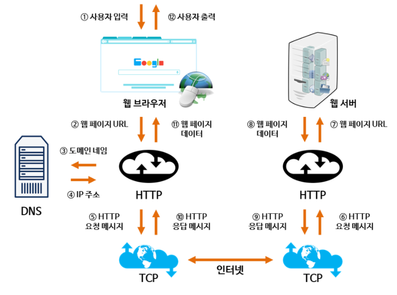
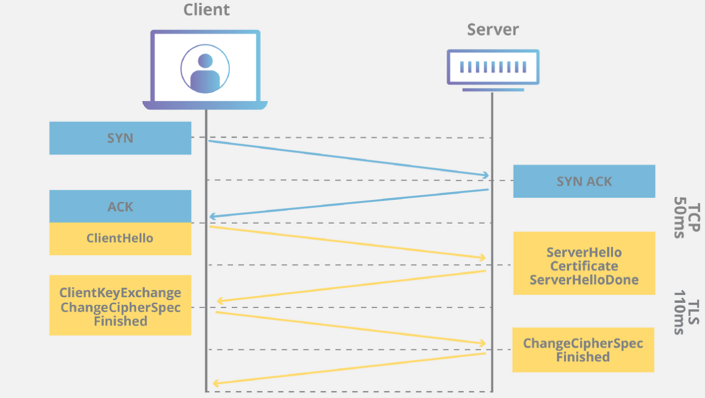

## 네트워크

### OSI 7 계층

통신 과정을 7단계로 나눈 국제 통신 표준 규약

각 통신 과정들을 단계를 나눔으로서 계층간의 독립성을 확보할 수 있다.

따라서 통신과정에 이상이 발생하면 이상이 있는 계층에 대해서만 작업을 수행하고 다른 계층은 영향을 받지 않기 때문에 디버깅이나 유지관리가 수월하다는 장점

7 계층(응용 계층): 사용자와 직접 상호작용하는 응용 프로그램들이 포함된 계층. HTTP, FTP, DNS 프로토콜 사용
6 계층(표현 계층): 데이터의 형식(Format)을 정의하는 계층. 파일을 인코딩하거나 명령어를 포장, 압축, 암호화 함
5 계층(세션 계층): 컴퓨터끼리 통신을 하기 위해 세션을 만드는 계층. 통신 시스템 사용자간의 연결을 유지 및 설정
4 계층(전송 계층): 최종 수신 프로세스로 데이터의 전송을 담당하는 계층. 양쪽간 신뢰성있는 데이터를 주고 받도록 흐름 제어나 중복검사, 오류 검출 및 복구와 같은 기능. TCP, UDP 프로토콜
3 계층(네트워크 계층): 패킷을 목적지까지 가장 빠른 길로 전송하기 위한 계층. 흐름제어, 세그멘테이션, 오류 제어, 인터네트워킹 등을 수행
2 계층(데이터링크 계층): 데이터의 물리적인 전송과 에러 검출, 흐름 제어를 담당하는 계층. 데이터 전송이 프레임 단위로 이뤄지며 MAC 주소를 통해 통신함
1 계층(물리 계층): 데이터를 전기 신호로 바꾸어주는 계층. 데이터를 전달하기만 할 뿐 그 외의 기능들에는 관여하지 않음

1. 1계층 : 물리계층(Physical Layer)

- 데이터를 전기 신호로 바꿔서 와이어에 실어주는 계층
- 장비 : 리피터(전기신호를 증폭), 허브
- 단위 :Bit

2. 2계층 : 데이터링크 계층(Data Link Layer)

- P2P 간 신뢰성있는 전송을 보장하기 위한 계층으로 CRC 기반의 오류 제어와 흐름 제어가 필요
- 주소값은 MAC Address를 물리적으로 할당받으며, NIC(=LAN카드)가 만들어질때부터 고유 일련번호가 있다.(사설 IP는 중복 가능)
- 단위 : Frame
- 장비 : Bridge, L2 Switch(중요)
- 프로토콜 : 이더넷(중요), HDLC

3. 3계층 : 네트워크 계층(Network Layer)

- IP주소 기반으로 경로를 찾아주는 계층
- 라우터를 통해 이동할 경로를 선택하여 IP 주소를 지정하고, 해당 경로에 따라 패킷을 전달
- 라우팅, 흐름 제어, 오류 제어, 세그멘테이션 등을 수행
- 단위 : Packet
- 프로토콜 : IP, RIP, ARP, ICMP
- 장비 : Router(L3 Switch)

4. 4계층 : 전송 계층(Transport Layer)

- TCP, UDP 등의 프로토콜을 통해 통신을 활성화
- 포트를 열어두고, 프로그램들이 전송할 수 있도록 제공
- 오류검출 및 복구, 흐름 제어, 중복검사 등 수행
- Port기반 데이터 세그먼트 전송
- 단위 : Segment(TCP) / Datagram(UDP)
- 프로토콜 : TCP / IP
- 장비 : 게이트웨이

5. 5계층 : 세션 계층(Session Layer)

- TCP/IP 세션을 만들고 없애는 책임을 지니고 있다.
- 세션 설정, 유지, 종료, 전송 중단시 복구 등의 기능이 있다.
- Ex) API, Socket

6. 6계층 : 표현 계층(Presentation) 계층

- 데이터 표현에 대한 독립성을 제공하고 암호화하는 역할
- 파이
- Ex) JPEG, MPEG 등
  사용자의 명령어를 완성 및 결과 표현. 포장/압축/암호화

7. 응용(Application) 계층

- 일반적인 응용 서비스를 수행한다.
- 사용자 인터페이스, 전자우편, 데이터베이스 관리 등의 서비스를 제공한다.
- HTTP, FTP, SMTP, IMAP, Telnet 등

### 3 Way-Handshake & 4 Way-Handshake

3-Way Handshake 는 TCP의 접속, 4-Way Handshake는 TCP의 접속 해제 과정

TCP 3 Way Handshake는 TCP/IP프로토콜을 이용해서 통신을 하는 응용프로그램이 데이터를 전송하기 전에 먼저 정확한 전송을 보장하기 위해 상대방 컴퓨터와 사전에 세션을 수립하는 과정을 의미

송신자와 수신자는 총 3번에 걸쳐 데이터를 주고 받으며 통신이 가능한 상태임을 확인한다.

양쪽 모두 상대편에 대한 초기 순차일련변호를 얻을 수 있도록 한다.

Client > Server : TCP SYN

Server > Client : TCP SYN, ACK

Client > Server : TCP ACK

여기서 SYN은 'synchronize sequence numbers', 그리고 ACK는'acknowledgment' 의 약자

[STEP 1]

A클라이언트는 B서버에 접속을 요청하는 SYN 패킷을 보낸다.

이때 A클라이언트는 SYN 을 보내고 SYN/ACK 응답을 기다리는 SYN_SENT 상태, B서버는 Wait for Client 상태이다.

[STEP 2]

B서버는 SYN요청을 받고 A클라이언트에게 요청을 수락한다는 ACK 와 SYN flag 가 설정된 패킷을 발송하고

A가 다시 ACK으로 응답하기를 기다린다. 이때 B서버는 SYN_RECEIVED 상태가 된다.

[STEP 3]

A클라이언트는 B서버에게 ACK을 보내고 이후로부터는 연결이 이루어지고 데이터가 오가게 되는것이다. 이때의 B서버 상태가 ESTABLISHED 이다.

3-Way handshake는 TCP의 연결을 초기화 할 때 사용한다면, 4-Way handshake는 세션을 종료하기 위해 수행되는 절차

[STEP 1]

클라이언트가 연결을 종료하겠다는 FIN플래그를 전송한다. 이때 A클라이언트는 FIN-WAIT 상태가 된다.

[STEP 2]

B서버는 FIN플래그를 받고, 일단 확인메시지 ACK 보내고 자신의 통신이 끝날때까지 기다리는데 이 상태가 B서버의 CLOSE_WAIT상태다.

[STEP 3]

연결을 종료할 준비가 되면, 연결해지를 위한 준비가 되었음을 알리기 위해 클라이언트에게 FIN플래그를 전송한다. 이때 B서버의 상태는 LAST-ACK이다.

[STEP 4]

클라이언트는 해지준비가 되었다는 ACK를 확인했다는 메시지를 보낸다.

A클라이언트의 상태가 FIN-WAIT ->TIME-WAIT 으로 변경된다.

그런데 만약 "Server에서 FIN을 전송하기 전에 전송한 패킷이 Routing 지연이나 패킷 유실로 인한 재전송 등으로 인해 FIN패킷보다 늦게 도착하는 상황"이 발생한다면 어떻게 되나?

Client에서 세션을 종료시킨 후 뒤늦게 도착하는 패킷이 있다면 이 패킷은 Drop되고 데이터는 유실될 것입니다.

A클라이언트는 이러한 현상에 대비하여 Client는 Server로부터 FIN을 수신하더라도 일정시간(디폴트 240초) 동안 세션을 남겨놓고 잉여 패킷을 기다리는 과정을 거치게 되는데 이 과정을 "TIME_WAIT" 라고 한다. 일정시간이 지나면, 세션을 만료하고 연결을 종료시키며, "CLOSE" 상태로 변화한다.

### TCP / UDP

모두 전송계층에서 사용되는 프로토콜

전송계층은 프로토콜 내에서 송신자와 수신자를 연결하는 통신 서비스를 제공하는 계층인데,

IP에 의해 전달되는 패킷의 오류를 검사하고 재전송 요구 등의 제어를 담당

TCP(Transmission Control Protocol)

TCP는 신뢰성 있는 데이터 전송을 지원하는 연결 지향형 프로토콜

일반적으로 TCP와 IP가 함께 사용되는데, IP가 데이터의 전송을 처리한다면 TCP는 패킷 추적 및 관리를 함

연결 지향형인 TCP는 3-way handshaking이라는 과정을 통해 연결 후 통신을 시작하는데, 흐름 제어와 혼잡 제어를 지원하며 데이터의 순서를 보장한다.

---

흐름 제어: 보내는 측과 받는 측의 데이터 처리속도 차이를 조절해주는 것

혼잡 제어: 네트워크 내의 패킷 수가 넘치게 증가하지 않도록 방지하는 것

---

특징

연결형 서비스로 가상 회선 방식을 제공
데이터의 전송 순서 보장

데이터의 경계를 구분하지 않음 - 스트림 데이터(나와 상대방 사이에서 tcp가 흐름 제어를 계속하면서 연결을 유지. 연결이 유지되므로 더 이상 주고받을 데이터가 없다면 연결 끊기)

신뢰성 있는 데이터 전송

UDP보다 전송속도가 느림

연결을 설정(3-way handshaking)과 해제(4-way handshaking)

UDP(User Datagram Protocol)

UDP는 비연결형 프로토콜로써, 인터넷상에서 서로 정보를 주고받을 때 정보를 보낸다는 신호나 받는다는 신호 절차를 거치지 않고 보내는 쪽에서 일방적으로 데이터를 전달하는 통신 프로토콜

TCP와는 다르게 연결 설정이 없으며, 혼잡 제어를 하지 않기 때문에 TCP보다 전송 속도가 빠름

그러나 데이터 전송에 대한 보장을 하지 않기 때문에 패킷 손실이 발생할 수 있다

특징

비연결형 서비스로 데이터그램 방식을 제공

비신뢰성

데이터의 경계를 구분 - 패킷 단위(udp/ip는 상대방에게 미리 허락을 구하지 않고 그냥 보내고 tcp처럼 상대방과의 흐름 제어가 없어서 데이터를 보내면 udp는 수신하는 쪽에서 한 번에 모두 받을 수 있도록 처리. 그래서 udp 프로토콜의 이름이 user datagram protocol입니다. 사용자가 보내는 데이터 패킷 그대로 상대방이 받을 수 있게 하는 프로토콜)

패킷 오버해드가 적어 네트워크 부하 감소

혼잡 제어를 하지 않기 때문에 TCP보다 빠름

TCP의 handshaking 같은 연결 설정이 없음

### GET vs POST

사용 목적 : GET은 서버의 리소스에서 데이터를 요청할 때, POST는 서버의 리소스를 새로 생성/업데이트 시 사용

요청에 body 유무 : GET은 URL 파라미터에 요청하는 데이터를 담아 보내기 때문에 HTTP message에 body가 없으며, POST는 body에 데이터를 담아 보내기 때문에 HTTP message에 body가 존재

멱등성(idempotent) : GET은 리소스를 조회한다는 점에서 여러 번 요청하더라도 응답이 똑같기 때문에 멱등이며, POST는 리소스 생성/업데이트 용도이기 때문에 멱등이 아니다.

GET, PUT, DELETE가 멱등하다.
POST 멱등X.
PATCH는 멱등성 항상 보장X (PUT은 요청에 대하여 리소스를 통째로 바꿔버리기 때문에 멱등성이 보장되지만, PATCH는 리소스의 일부에 대하여 변화를 명령할 수 있기 때문)

### PUT vs PATCH

PUT : 자원의 전체 교체, 자원 교체시 모든 필드 필요 (만약 전체가 아닌 일부만 전달할 경우, 전달한 필드 외 모두 null or 초기값 처리되니 주의)

PATCH : 자원의 부분교체, 자원 교체시 일부 필드 필요

### HTTP vs HTTPS

HTTP는 Hypertext Transfer Protocol의 약자로 서로 다른 시스템들 사이에서 통신을 주고받게 해주는 가장 기초적인 통신 규약

HTTP는 기본적으로 평문 데이터 전송을 원칙으로 하기 때문에 개인의 프라이버시가 오가는 서비스들(전자상거래, 전자메일, 사내 문서 등)에 사용하기 부적합

네트워크에서 신호를 가로채 본다면 내용이 노출된다

기존 HTTP가 위변조에 취약하다는 점을 보완하기 위해 암호화나 인증 구조를 더한 것을 HTTPS(HTTP Secure)

HTTPS는 HTTP의 기능에 TLS(Transport Layer Security) 혹은 SSL(Secure Sockets Layer)을 사용하여 암호화된 버전

SSL 인증서란? SSL 프로토콜에 사용되는 인증서, 클라이언트가 접속한 서버가 신뢰할 수 있는 서버임을 보증하고 통신에 사용할 공개키를 클라이언트에 전달

### DNS

도메인은 웹 브라우저를 통해 특정 사이트에 진입을 할 때, IP 주소를 대신하여 사용하는 주소

DNS는 DNS는 Domain Name System의 줄임말로, 데이터베이스 시스템

호스트의 도메인 이름을 IP 주소로 변환하거나 반대의 경우를 수행할 수 있도록 개발된 데이터베이스 시스템

DNS(Domain Name System)는 범국제적 단위로 웹사이트의 IP 주소와 도메인 주소를 이어주는 환경/시스템

DNS 시스템 안에서 이어주는 역할을 하는 서버를 풀네임으로 DNS 서버

네트워크 상에 존재하는 모든 PC는 IP 주소가 있다.
그러나 모든 IP 주소가 도메인 이름을 가지는 것은 아니다.
로컬 PC를 나타내는 127.0.0.1 은 localhost 로 사용할 수 있지만, 그 외의 모든 도메인 이름은 일정 기간 동안 대여하여 사용한다

브라우저의 검색창에 도메인 이름을 입력하여 해당 사이트로 이동하기 위해서는, 해당 도메인 이름과 매칭된 IP 주소를 확인하는 작업이 반드시 필요. 네트워크에는 이것을 위한 서버가 별도로 있다. 이 서버가 바로 DNS 서버

브라우저의 검색창에 naver.com을 입력한다.
이 요청은 DNS에서 IP 주소(125.209.222.142)를 찾는다.
그리고 이 IP 주소에 해당하는 웹 서버로 요청을 전달하여 클라이언트와 서버가 통신할 수 있도록 한다

### DNS RoundRobin

DNS 로드밸런싱은 별도의 하드웨어 장비나, 소프트웨어 없이 사용자가 DNS를 이용하여 도메인 정보를 조회하는 시점에서 트래픽을 분산하는 기법

DNS Load Balancing 기법 중에 Round robin 방식은 부하 분산의 대표적인 알고리즘인데, 순서대로 돌아가면서 (보통 시간 단위) 각각의 서버로 트래픽을 분산시켜서 처리하는 알고리즘

장점

- 중간 장비(로드밸런서 등) 없이도 서비스가 가능하다.
- 간편하다.

단점

- 서버의 수 만큼 공인 IP 주소가 필요하다.
- 서버에 장애가 발생해도 감지하지 않고 부하를 분산시킨다.
- 일반적인 로드밸런싱은 Health check를 수반한다. 라운드 로빈 DNS는 별도로 Health check를 하지 않는다.
- DNS 결과를 Caching해서 재사용하기 때문에 균등한 분산이 어렵다.

해결방안

- 가중치 편성 방식(Weighted Round Robin) : 각각의 웹서버에 가중치를 부여해서 서버의 규모가 큰 곳에 부하를 분산시키도록 하는 방법이다. 즉, 규모가 큰 곳에 가중치를 두면 그곳의 IP주소를 DNS가 주로 제공할 것이기에 부하를 분산시킬 수 있다.

- 다중화 구성 방식 : AP 서버에 VIP(Virtual IP)를 부여한 다음에 VIP에 문제가 생기면 정상 AP 서버로 인계하는 방식이다. 즉 DNS Server Table 에 실시간으로 AP 서버의 상태를 확인할 수 있는 칼럼 및 함수를 추가하여 요청될 경우 서버 상태를 확인하여 우회루트를 제공하거나 에러를 전송하는 방식을 말합니다.

- Round Robin을 사용하면 로드밸런서를 쓰지 않아도 되지만, 단점을 보완하기 위해 로드 밸런서를 사용해서 해결할 수 있다. 최소 연결 방식 (Least connection) 을 사용하는 것이다. 이는 접속 클라이언트 수가 가장 적은 서버를 선택하는 방식으로, 로드밸런서에서 실시간으로 connection 수를 관리하거나 각 서버에서 주기적으로 알려주는 것이 필요하다.

### www.naver.com에 접속할 때 생기는 과정(웹 동작 방식 이해)

①② 사용자가 웹 브라우저를 통해 찾고 싶은 웹 페이지의 URL 주소를 입력함.

③ 사용자가 입력한 URL 주소 중에서 도메인 네임(domain name) 부분을 DNS 서버에서 검색함.

④ DNS 서버에서 해당 도메인 네임에 해당하는 IP 주소를 찾아 사용자가 입력한 URL 정보와 함께 전달함.

⑤⑥ 웹 페이지 URL 정보와 전달받은 IP 주소는 HTTP 프로토콜을 사용하여 HTTP 요청 메시지를 생성함.

이렇게 생성된 HTTP 요청 메시지는 TCP 프로토콜을 사용하여 인터넷을 거쳐 해당 IP 주소의 컴퓨터로 전송됨.

⑦ 이렇게 도착한 HTTP 요청 메시지는 HTTP 프로토콜을 사용하여 웹 페이지 URL 정보로 변환됨.

⑧ 웹 서버는 도착한 웹 페이지 URL 정보에 해당하는 데이터를 검색함.

⑨⑩ 검색된 웹 페이지 데이터는 또다시 HTTP 프로토콜을 사용하여 HTTP 응답 메시지를 생성함.

이렇게 생성된 HTTP 응답 메시지는 TCP 프로토콜을 사용하여 인터넷을 거쳐 원래 컴퓨터로 전송됨.

⑪ 도착한 HTTP 응답 메시지는 HTTP 프로토콜을 사용하여 웹 페이지 데이터로 변환됨.

⑫ 변환된 웹 페이지 데이터는 웹 브라우저에 의해 출력되어 사용자가 볼 수 있게 됨

### 쿠키 vs 세션

HTTP 프로토콜에는 비연결성(Connectionless)과 비상태성(Stateless)이라는 특징이 있다.
비연결성 : 서버의 자원을 절약하기 위해 모든 사용자의 요청마다 연결과 해제의 과정을 거치기 때문에 연결 상태가 유지되지 않음
비상태성 : 연결 해제 후에 상태 정보가 저장되지 않음

쿠키 : 웹 사이트에 접속할 때 생성되는 정보를 담은 임시 파일(서버가 사용자의 웹 브라우저에 저장하는 데이터)

쿠키의 데이터 형태는 key와 value로 구성되고 string 형태로 이루어져있다(브라우저마다 저장되는 쿠키는 다르다-서버에서는 브라우저가 다르면 다른 사용자로 인식한다).

쿠키는 서버를 대신해서 이러하 정보들을 웹 브라우저를 이요하고 있는 컴퓨터에 저장한다. 사용자가 요청을 할 때 그 정보를 함께 보내서 서버가 사용자를 식별할 수 있게 한다.

쿠키 예시
쿠키가 있기 때문에 여러 페이지를 이동할 때마다 로그인을 하지 않고 사용자 정보를 유지할 수 있는 것.
쿠키가 없다면 다음 페이지로 정보를 파라미터로 넘겨줘야한다.

- ID 저장, 로그인 상태 유지
- 일주일간 다시 보지 않기
- 최근 검색한 상품들을 광고에서 추천
- 쇼핑몰 장바구니 기능

쿠키의 동작 순서

1. 클라이언트가 페이지를 요청한다. (사용자가 웹사이트 접근)
2. 웹 서버는 쿠키를 생성한다.
3. 생성한 쿠키에 정보를 담아 HTTP 화면을 돌려줄 때,
   같이 클라이언트에게 돌려준다.
4. 넘겨 받은 쿠키는 클라이언트가 가지고 있다가(로컬 PC에 저장) 다시 서버에 요청할 때 요청과 함께 쿠키를 전송한다.
5. 동일 사이트 재방문시 클라이언트의 PC에 해당 쿠키가 있는 경우, 요청 페이지와 함께 쿠키를 전송한다.

쿠키의 단점

- 서버가 가지고 있는 것이 아니라 사용자에게 저장되기 때문에, 임의로 고치거나 지울 수 있고, 가로채기도 쉬워 보안이 취약하다

세션 : 일정 시간동안 같은 사용자(브라우저)로부터 들어오는
일련의 요구를 하나의 상태로 보고, 그 상태를 일정하게 유지시키는 기술

즉, 방문자가 웹 서버에 접속해 있는 상태를 하나의 단위로 보고 그것을 세션이라 함

세션 아이디는 웹 브라우저 당 1개씩 생성되어 웹 컨테이너에 저장되며 브라우저 종료시 소멸된다.

각 클라이언트 고유 Session ID를 부여한다.
Session ID로 클라이언트를 구분하여 각 클라이언트 요구에 맞는 서비스 제공

로그인한 사용자에 대해서만 세션을 생성하는 것이 아니라, 로그아웃하면 새로운 사용자로 인식해서 새로운 세션이 생성됨
(쿠키는 웹 브라우저 내에 저장된 것이라 로그아웃 유무와 무관하게 삭제하지 않으면 유지된다)

아이디, 닉네임 등의 정보를 세션에 담아두면 요청이 있을 때마다 DB에 접근할 필요 없어 효율적

세션의 동작 순서

1. 클라이언트가 페이지를 요청한다. (사용자가 웹사이트 접근)
2. 서버는 접근한 클라이언트의 Request-Header 필드인 Cookie를 확인하여, 클라이언트가 해당 session-id를 보냈는지 확인한다.
3. session-id가 존재하지 않는다면, 서버는 session-id를 생성해 클라이언트에게 돌려준다.
4. 서버에서 클라이언트로 돌려준 session-id를 쿠키를 사용해 서버에 저장한다.
5. 쿠키 이름 : JSESSIONID
6. 클라이언트는 재접속 시, 이 쿠키(JSESSIONID)를 이용하여 session-id 값을 서버에 전달

쿠키 vs 세션 비교

1. 저장 위치

- 쿠키 : 클라이언트의 웹 블라우저가 지정하는 메모리 또는 하드디스크에 저장
- 세션 : 서버의 메모리

2. 저장방식

- 쿠키 : text형식
- 세션 : Object 형식

3. 리소스(사용되는 자원)

- 쿠키 : 클라이언트에 저장되고, 클라이언트의 메모리를 사용하기에 서버의 자원 사용X
- 세션 : 세션은 서버에 저장되고 서버의 메모리로 로딩이 되기 때문에 세션이 생길 때마다 서버의 리소스를 차지

4. 용량 제한

- 쿠키 : 클라이언트도 모르게 접속되는 사이트에 의해 설정될수 있기 때문에 쿠키로 인해 문제가 발생하는 것을 방지하기 위해 한 도메인당 20개, 하나의 쿠키당 4KB로 제한
- 세션: 갯수나 용량 제한에 제한 X

5. 만료 시점

- 쿠키 : 저장할 떄 expires 속성을 정의해 무효화 시키면 삭제될 날짜를 지정할 수 있음(따로 지정되지 않은 경우에는 브라우저 종료시 만료)
- 세션 : 클라이언트가 로그아웃 하거나, 설저한 시간 동안 반응이 없을 경우 무효화되기 때문에 정확한 시점 알수 X

쿠키는 자동완성이나, 팝업 일주일간 보지 않기 등 사용자의 편의를 위하는 것이지만 지워져도 되고, 조작되거나 가로채이더라도 큰 지장이 없는 수준의 정보들을 저장하는데 사용

사용자나 다른 누군가에게 노출되면 안되는 중요한 정보들은 세션으로 서버안에서 다뤄짐

쿠키로 노출시켜서는 안될 정보들이 있고, 세션을 남발하면 서버에 부담이 되어 과부하가 일어나기 때문에

웹을 설계할 때는 이 정보는 쿠키에 저장할 지 세션에 저장할 지 적절한 판단을 내릴 수 있어야 함

https://thecodinglog.github.io/web/2020/08/11/what-is-session.html

### 대칭키 vs 공개키

대칭키 : 암복호화키가 동일한 암호화 방식

하나의 키로 데이터를 암호화하고 복호화.
하나의 키로 암호화 및 복호화를 하기 때문에 해당 키가 노출된다면 보안 상 아주 치명적인 문제가 발생한다. 다만, 암호화 및 복호화에 드는 비용이 적다는 장점이 있다.

대칭 키 방식은 암호를 주고 받는 사람들 사이에 대칭 키를 전달하는 것이 어렵다. 왜냐하면 위에서 언급했듯이 대칭 키가 유출되면 키를 획득한 공격자는 암호의 내용을 복호화 할 수 있기 때문이다.

ex) DES, 3DES, AES, SEED, ARIA

장점 : 속도가 빠르다

단점 : 키를 교환해야한다는 문제(키 배송문제) - 키를 교환하는 중 키가 탈취될 수 있는 문제도 있고 사람이 증가할수록 전부 따로따로 키교환을 해야하기 때문에 관리해야 할 키가 방대하게 많아진다. 이러한 키 배송 문제를 해결하기 위한 방법으로 키의 사전 공유에 의한 해결, 키 배포센터에 의한 해결, Diffie-Hellman 키 교환에 의한 해결, 공개키 암호에 의한 해결이 있다.

공개키

공개키 암호화 방식은 암복호화에 사용하는 키가 서로 다르며 따라서 비대칭키 암호화라고도 한다. 따라서 공개키 암호화 에서는 송수신자 모두 한쌍의 키(개인키, 공개키)를 갖고있게 된다.
비대칭 키는 공개 키와 개인 키로 암호화 및 복호화를 수행한다. 즉, 공개 키로 데이터를 암호화하면 반드시 개인 키로만 복호화 가능하고, 개인 키로 데이터를 암호화하면 공개 키로만 복호화 할 수 있다. 참고로 개인 키는 비밀 키 혹은 비공개 키라고도 부른다. 비대칭 키는 보안성이 좋지만, 구현이 하기 어렵고 암호화 및 복호화 속도가 느리다는 단점이 있다.

예를 들어, A가 B에게 데이터를 보낸다고 할 때, A는 B의 공개키로 암호화한 데이터를 보내고 B는 본인의 개인키로 해당 암호화된 데이터를 복호화해서 보기 때문에 암호화된 데이터는 B의 공개키에 대응되는 개인키를 갖고 있는 B만이 볼 수 있게 되는 것이다.

장점: 키분배 필요X, 기밀성/인증/부인방지 기능을 제공

단점: 구현 어려움. 대칭키 암호화 방식에 비해 속도가 느림

암호화 - 공개 키, 복호화 - 개인 키: 진짜 데이터를 암호화하여 보호하기 위한 목적이다.

암호화 - 개인 키, 복호화 - 공개 키: 인증을 위한 목적이다. 즉, 서버에서 개인 키로 데이터를 암호화해서 보냈고 클라이언트에서 공개 키로 복호화가 된다면 해당 서버는 클라이언트 입장에서 신뢰할 수 있다고 판단할 수 있다.

### SSL Handshake

SSL : secured socket layer
TLS : transport layer security

참고 : https://steady-coding.tistory.com/512

SSL은 대칭 키 방식과 비대칭 키 방식을 섞어서 사용

1. A가 B로 접속 요청을 보낸다
2. B는 A에게 자신의 공개 키를 전송한다(B는 미리 공개키와 개인키를 만들어 두었다)
3. A는 자신의 대칭 키를 B에서 전달 받은 B의 공개 키로 암호화한다.
4. 이렇게 암호화한 자신의 대칭 키를 B에게 전달한다.
5. B는 자신의 개인 키로 복호화하여 A의 대칭 키를 얻어낸다.
6. 이렇게 얻어낸 대칭 키를 활용해서 A와 B는 안전하게 통신한다.

즉, 데이터 암호화와 복호화를 위한 한 쪽의 대칭 키를 다른 쪽의 공개 키로 암호화하여 전송하면, 반대편에서 자신의 개인 키로 복호화하여 그 반대편의 대칭 키를 알아내고, 이 대칭 키를 바탕으로 통신을 하게 된다.

파란색 칸과 노란색 칸은 네트워크 상에서 전달되는 IP 패킷을 표현한 것이다. 파란색 칸에 해당하는 SYN, SYN ACK, ACK는 TCP 레이어의 3-way handshake로, HTTPS가 TCP 기반의 프로토콜이므로 SSL Handshke에 앞서 연결을 생성하기 위해 실시하는 과정

CA(Certificate Authority)

인증서의 역할은 클라이언트가 접속한 서버가 의도한 서버가 맞는지 보장하는 것

이 역할을 하는 민간 기업들이 있는데 이런 기업들을 CA(Certificate authority) 혹은 Root Certificate라고 부른다. CA는 신뢰성이 엄격하게 공인된 기업들만 참여할 수 있다.

개발자 입장에서 HTTPS를 적용하려면 신뢰할 수 있는 CA 기업의 인증서를 구입해야 한다. 이 인증서를 구입하게 되면 CA 기업의 개인 키를 이용하여 암호화 한 인증서를 준다.

###### SSL 인증서

SSL 인증서에는 서비스의 정보 (인증서를 발급한 CA, 서비스의 도메인 등)와 서버 측 공개 키가 들어 있다.

그러면 서버에서는 본인의 개인 키를 생성하였고, 클라이언트가 사용할 공개 키는 인증서 안에 담겨 있는데, 클라이언트는 CA의 개인 키로 암호화 된 인증서를 어떻게 복호화 할까?

바로, 우리가 사용하는 일반적인 브라우저에 신뢰할 수 있는 CA 기관의 리스트와 해당 기관의 공개키를 이미 가지고 있다. 그래서 클라이언트는 내장된 CA의 공개 키를 활용하여 인증서를 복호화함으로써 인증서를 검증한 뒤, 서버의 공개 키를 가져올 수 있다.

1. ClientHello
   클라이언트가 서버에 연결을 시도하며 전송하는 패킷이다.

   자신이 사용 가능한 Cipher Suite 목록, Session ID, SSL 프로토콜 버전, Random Byte 등을 전달한다.

   Cipher Suite는 SSL 프로토콜 버전, 인증서 검정, 데이터 암호화 프로토콜, Hash 방식 등의 정보를 담고 있는 존재로, 선택된 Cipher Suite의 알고리즘에 따라 데이터를 암호화하게 된다.

2. ServerHello

   서버는 클라이언트가 보내 온 ClientHello 패킷을 받아 Cipher Suite 중 하나를 선택한 다음 클라이언트에게 이를 알린다.

   또한, 자신의 SSL 프로토콜 버전 등도 같이 보낸다. 아래 사진을 보면 ClientHello에서 17개였던 Cipher Suite와 달리 Sever가 선택한 한 줄만 존재하는 것을 알 수 있다.

3. Certificate

   Server가 자신의 SSL 인증서를 클라이언트에게 전달한다.

   인증서 내부에는 Server가 발행한 공개 키 (개인 키는 따로 서버가 소유)가 들어있다.

   클라이언트는 서버가 보낸 CA (Certificate Authority, 인증 기관)의 개인 키로 암호화된 이 SSL 인증서를 이미 모두에게 공개된 CA의 공개 키를 사용하여 복호화한다.

   복호화에 성공하면 이 인증서는 CA가 서명한 것이 맞으니 진짜임을 검증할 수 있다.

4. Server Key Exchange / ServerHello Done

   서버의 공개 키가 SSL 인증서 내부에 없는 경우, 서버가 직접 전달한다는 뜻이다.

   공개 키가 SSL 인증서 내부에 있을 경우 Server Key Exchange는 생략된다.

   인증서 내부에 서버의 공개 키가 있다면, 클라이언트가 CA의 공개 키를 통해 인증서를 복호화 한 후 서버의 공개 키를 확보할 수 있다. 그리고 서버가 행동을 마쳤음을 전달한다.

5. Client Key Exchange

   클라이언트는 데이터 암호화에 사용할 대칭 키를 생성한 후 SSL 인증서 내부에서 추출한 서버의 공개 키를 이용해 암호화한 후 서버에게 전달한다.

   여기서 전달된 대칭 키가 SSL Handshake의 목적이자 가장 중요한 수단인 데이터를 실제로 암호화할 대칭 키다.

   이제 키를 통해 클라이언트와 서버가 실제로 교환하고자 하는 데이터를 암호화한다.

6. ChangeCipherSpec / Finished

   ChangeCipherSpec 패킷은 클라이언트와 서버 모두가 서로에게 보내는 패킷으로, 교환할 정보를 모두 교환한 뒤 통신할 준비가 다 되었음을 알리는 패킷이다.

   그리고 Finished 패킷을 보내어 SSL Handshake를 종료하게 된다.

요약

서버는 CA에 사이트 정보와 공개 키를 전달하여 인증서를 받음 → 클라이언트는 브라우저에 CA 공개 키가 내장되어 있다고 가정 → ClientHello(암호화 알고리즘 나열 및 전달) → ServerHello(암호화 알고리즘 선택) → Server Certificate(인증서 전달) → Client Key Exchange(데이터를 암호화 할 대칭 키 전달) → Client / ServerHello done (정보 전달 완료) → Finished(SSL Handshake 종료)

참고 : https://steady-coding.tistory.com/512

### 로드 밸런싱(Load Balancing)

로드 밸런싱이란?

서버가 처리해야 할 업무 혹은 요청(load)을 여러 대의 서버로 나누어(balancing) 처리하는 것이다. 여러 대의 서버에서 서비스를 제공하는 분산 처리 시스템에서 필요하다.

한 대의 서버로 부하가 집중되지 않도록 트래픽을 관리해 각각의 서버가 최적의 퍼포먼스를 보일 수 있도록 하는 것이 목적

기존의 서버 성능을 확장하는 Scale-Up 방식과 기존의 서버와 동일하거나 낮은 성능의 서버를 증설하는 Scale-Out 방식이 있다. Scale-Out 방식으로 서버를 증설한다면, 로드 밸런싱이 반드시 필요하다.

VIP란?

VIP란 로드 밸런싱의 대상이 되는 여러 서버를 대표하는 가상의 IP이다. 클라이언트들은 서버의 IP로 직접 요청을 하는 것이 아니라 LB가 가지고 있는 VIP를 대상으로 요청한다. 그리고 LB는 설정된 부하 분산 방법에 따라 각 서버로 요청을 분산한다.

로드 밸런서의 기본 기능은?

1. 상태 확인 : 로드 밸런서는 서버들에 대한 주기적인 상태 확인을 통해 서버들의 장애 여부를 판단할 수 있다. 이로 인해, 서버에 이상이 생기면 정상적으로 동작하는 서버로 트래픽을 보내 주는 Fail-Over가 가능하며, 또한 TCP/UDP 분석이 가능하기 때문에 방화벽의 역할도 수행할 수 있다.

2. Tunneling : 터널링은 인터넷 상에서 눈에 보이지 않는 통로를 만들어 통신할 수 있게 하는 개념이다. 데이터를 캡슐화해서 연결된 상호 간에만 캡슐화된 패킷을 구별해 캡슐화를 해제할 수 있다.

로드 밸런서의 VIP 주소로 향하는 요구 패킷이 로드 밸런싱 서버로 전달되면 로드 밸런싱 서버에서 패킷의 목적지 주소와 포트를 검사하여 가상 서버 정책과 일치할 경우, 스케줄링에 따라 실제 작업 서버로 전달하게 된다. 이때 패킷을 일반적인 스트림 방식으로 전달하는 것이 아닌 캡슐 형식으로 감싸서 전달하게 된다. 이렇게 전달되면 작업 서버에서는 감싸진 패킷을 다시 풀고 요청을 처리한다.

3. NAT(Network Address Translation) : IP 주소를 변환해 주는 기능이다. 예를 들어, 내부 네트워크에서 사용하던 사설 IP 주소를 로드 밸런서 외부의 공인 IP 주소로 변경해 주며, 반대 과정도 가능하다. 이렇게 하면 부족한 공인 IP 주소를 효율적으로 사용할 수 있지만, 로드 밸런싱 관점에서는 여러 개의 호스트가 하나의 공인 IP 주소 (VIP)를 통해 접속하는 것이 주 목적이다.

서버의 이상 유무를 파악하는 상태 확인(Health Check), 패킷을 캡슐화해서 연결된 상호 간에만 패킷을 구별할 수 있게 해주는 터널링(Tunneling), IP 주소를 변환해주는 NAT

로드 밸런싱 기법

- 라운드 로빈(Round-Robin) : 서버에 들어온 요청을 순서대로 돌아가며 배정하는 방식

클라이언트 요청을 순서대로 분배함. 여러 대의 서버가 동일한 스펙을 갖고 있고, 세션이 오래 지속되지 않는 경우 사용.

- 가중 라운드 로빈(Weighted Round-Robin) : 각각의 서버마다 가중치를 매기고 가중치가 높은 서버를 우선으로 돌아가며 배정하는 방식.

주로 서버의 트래픽 처리 능력이 상이한 경우 사용.

- IP 해시(IP Hash) : 클라이언트의 IP 주소를 특정 서버로 매핑하여 요청을 처리하는 방식

사용자의 IP를 해싱해 로드를 분배하므로 사용자가 항상 동일한 서버로 연결되는 것을 보장.

- 최소 연결(Least Connection) : 요청이 들어온 시점에 가장 적은 연결상태를 보이는 서버에 우선적으로 트래픽을 배분하는 방식.

주로 세션이 자주 길어지거나 서버에 분배된 트래픽들이 일정하지 않은 경우 사용

- 최소 응답 시간(Least Response Time) : 서버의 현재 연결 상태와 응답 시간을 모두 고려하여 트래픽을 배분하는 방식. 가장 적은 연결 상태와 가장 짧은 응답 시간을 보이는 서버에 우선적으로 로드를 배분.

로드밸런서의 종류와 로드밸런싱의 방법

로드 밸런서는 OSI 7 계층을 기준으로 어떻게 부하를 분산하는지에 따라 종류가 나뉜다. 2 계층을 기준으로 부하를 분산한다면 L2, 3 계층을 기준으로 분산한다면 L3인 방식이다. 상위 계층으로 갈수록 섬세한 부하 분산이 가능하지만, 가격과 성능에 드는 비용이 증가한다.

부하 분산에는 L4 로드 밸런서와 L7 로드 밸런서가 가장 많이 활용된다. 그 이유는 L4부터 포트 정보를 바탕으로 분산하는 것이 가능하기 때문이다. 한 대의 서버에 각각 다른 포트 번호를 부여하여 다수의 서버 프로그램을 운영하는 경우라면 최소 L4 이상을 사용해야 한다.

L4 로드 밸런싱 & L7 로드 밸런싱

L4는 Layer 4(전송 계층) 프로토콜, L7은 Layer 7(응용 계층) 프로토콜의 헤더를 부하 분산에 이용해서 붙은 접두사이다.

L4 로드 밸런싱 : 네트워크 계층(IP, IPX)이나 전송 계층(TCP, UDP)의 정보(IP 주소, 포트 번호, MAC 주소, 전송 프로토콜)를 바탕으로 로드를 분산한다.

- 데이터 안을 들여다보지 않고 패킷 레벨에서만 로드를 분산하기 때문에 속도가 빠르고 효율이 높지만, 섬세한 라우팅이 불가능함.
- 데이터의 내용을 복호화할 필요가 없어 안전함.
- L7 로드 밸런서보다 가격이 저렴함.
- 사용자의 IP가 수시로 바뀌는 경우라면 연속적인 서비스를 제공하기 어려움.

L7 로드 밸런싱 : 애플리케이션 계층(HTTP, FTP, SMTP)에서 HTTP 헤더, 쿠키 등 사용자의 요청을 기준으로 로드를 분산한다. 즉, 패킷의 내용을 확인하고 그 내용에 따라 로드를 특정 서버에 분배한다.

- 특정한 패턴을 지닌 바이러스를 감지해 네트워크를 보호할 수 있다.
- DoS/DDoS와 같은 비정상적인 트래픽을 필터링할 수 있어 서비스 안정성이 높아 네트워크 보안 분야에서도 활용된다.
- 상위 계층에서 로드를 분산하기 때문에 훨씬 더 섬세한 라우팅이 가능함.
- 캐싱 기능을 제공함.
- 패킷의 내용을 복호화하므로 비용이 높음.
- 클라이언트가 로드밸런서와 인증서를 공유하기 때문에 - 로드밸런서를 통해 클라이언트의 데이터에 접근할 수 있는 위험성이 존재함.

로드 밸런서가 장애를 대비하는 방법
: 로드 밸런서는 갑작스러운 장애에 대비해 이중화를 기본으로 구성한다. 이중화된 로드 밸런서들은 서로의 상태를 확인하며 장애가 발생하면 정상적으로 작동하는 로드 밸런서로 교체된다.

더 자세한 설명 : https://steady-coding.tistory.com/535

### 동기 & 비동기 & 블로킹 & 논블로킹

서로 전혀 다른 곳에 초점을 맞춘 개념이므로 서로 직접적 관련이 없다. 단지 조합하여 사용되는 것 뿐.

동기 & 비동기 : 작업 완료 여부(작업 완료를 기다리는지 안 기다리는지)

- 동기
  - 현재 작업의 응답이 끝남과 동시에 다음 작업이 요청된다.
  - 함수를 홏출하는 곳에서 호출되는 함수가 결과를 반환할 때까지 기다린다.
  - 작업 완료 여부를 계속해서 확인한다.
- 비동기
  - 현재 작업의 응답이 끝나지 않은 상태에서 다음 작업이 요청된다.
  - 함수를 호출하는 곳에서 결과를 기다리지 않고, 다른 함수(callback)에서 결과를 처리한다
  - 작업 완료 여부를 확인하지 않는다

블로킹 & 논블로킹 : 주로 멀티 스레딩, I/O 등에서 사용되는 개념이며, 제어권에 따라 차이가 난다.

제어권 : 제어권은 자신(함수)의 코드를 실행할 권리같은 것. 제어권을 가진 함수는 자신의 코드를 끝까지 실행한 후, 자신을 호출한 함수에게 돌려준다

- 블로킹 : A함수가 B함수를 호출하면, 제어권을 A가 호출한 B함수에 넘겨준다(B함수에서 작업이 모두 끝나면 값은 리턴하고, 다시 호출한 함수A로 제어권이 돌아온다)

- 논블로킹 : A함수가 B함수를 호출해도 제어권은 그대로 자신, 즉 A가 가지고 이쎅 된다. 값의 리턴이 함수의 실행과 동시에 이루어지는 특징이 있다.

추천 예시 :
https://velog.io/@ken1204/%EB%8F%99%EA%B8%B0%EB%B9%84%EB%8F%99%EA%B8%B0-%EB%B8%94%EB%A1%9C%ED%82%B9%EB%85%BC%EB%B8%94%EB%A1%9C%ED%82%B9%EC%9D%98-%EC%B0%A8%EC%9D%B4%EC%A0%90
