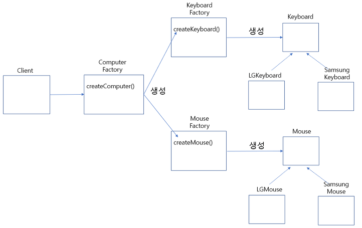
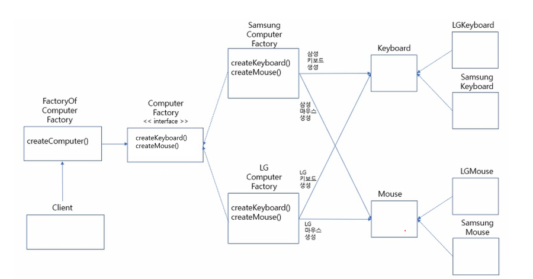

## 디자인 패턴

### 디자인패턴 목적, 구조, 분류

디자인 패턴이란 프로그램을 설계할 때 발생했던 문제점들을 객체 간의 상호 관계 등을 이용하여 해결할 수 있도록 하나의 '규약' 형태로 만들어 놓은 것

사용 목적, 장점

1. reusable, flexible : 재사용성을 높이고 변경을 쉽게 하도록 하는 구조

처음 보는 문제에 대해서도 단점을 최소화하는 설계 가능

2. 커뮤니케이션 : 구체적인 설명 없이 구조화된 패턴에 대한 사전 지식으로 커뮤니케이션에 드는 시간, 비용 절약(shared terms). 새로 보는 소프트웨어에 대해서도 패턴에 대한 지식 기반으로 이해가 수월하다.

3. 설계 과정의 속도를 높일 수 있다 : 이미 검증되고 테스트 된 구조이기 때문

디자인 패턴 구조

콘텍스트(Context), 문제(Problem), 해결(Solution) 이라는 3개의 필수적인 요소로 구성

[콘텍스트] : 문제가 발생하는 여러 상황을 기술한다. 즉, 패턴이 적용될 수 있는 상황을 나타낸다. 경우에 따라서는 패턴이 유용하지 못한 상황을 나타내기도 한다.

[문제] : 패턴이 적용되어 해결될 필요가 있는 여러 디자인 이슈들을 기술한다. 이때 여러 제약 사항과 영향력도 문제 해결을 위해 고려해야 한다.

[해결] : 문제를 해결하도록 설계를 구성하는 요소들과 그 요소들 사이의 관계, 책임, 협력 관계를 기술한다. 해결은 반드시 구체적인 구현 방법이나 언어에 의존적이지 않으며 다양한 상황에 적용할 수 있는 일종의 템플릿이다.

GoF (Gang of Four) 디자인 패턴

Gof 디자인 패턴은 에리히 감마, 리차드 헬름, 랄프 존슨, 존 블리시디스가 소프트웨어 개발 영역에서 디자인 패턴을 구체화하고 체계화한 GoF라 불리는 사람들의 이름이다.

GoF 디자인 패턴은 생성 패턴, 구조 패턴, 행위 패턴 총 3가지로 분류 된다.

디자인 패턴 분류

- 생성 패턴 Creational Patterns : 객체의 생성과정에 관여하는 패턴

  인스턴스화(인스턴스 생성)을 추상화한 패턴

  객체의 생성과 조합을 캡슐화해 특정 객체가 생성 되거나 변경되어도 프로그램 구조에 영향을 크게 받지 않도록 유연성을 제공

  객체의 생성과 구성 과정을 시스템에 독립적으로 이루어질 수 있도록 함

- Abstract Factory
- Builder
- Factory Method
- Prototype
- Singleton

- 구조 패턴 Structural Patterns : 클래스와 object가 더 큰 structure를 만드는 방법을 추상화

  예를 들어 서로 다른 인터페이스를 지닌 2개의 객체를 묶어 단일 인터페이스를 제공하거나 객체들을 서로 묶어 새로운 기능을 제공하는 패턴

  - Adapter
  - Bridge
  - Composite
  - Decorator
  - Facade
  - FlyWeight
  - Proxy

- 행위 패턴Behavioral Patterns : 객체간 책임을 할당하는 방법을 추상화

  객체 그 자체의 패턴과 객체간 소통 방법을 다룸
  객체간 communication pattern을 identify

  가령 한 객체가 혼자 수행할 수 없는 작업을 여러 개의 객체로 어떻게 분배하는지, 또 그렇게 하면서도 객체사이의 결합도를 최소화하는 것에 중점을 둔다

  - Command
  - Interpreter
  - Iterator
  - Meditator
  - Momento
  - Observer
  - State
  - Strategy
  - Template Method
  - Visitor

### SingleTon

하나의 클래스에 오직 하나의 인스턴스만 가지는 패턴

객체의 인스턴스가 오직 1개만 생성되는 패턴

싱글톤 패턴은 객체가 프로그램 내부에서 단 1개만 생성됨 을 보장하며 멀티 스레드에서 이 객체를 공유하며 동시에 접근하는 경우에 발생하는 동시성 문제도 해결

주로 공통된 객체를 여러 개 생성해서 사용하는 DBCP(DataBase Connection Pool)와 같은 상황에서 많이 사용된다고 한다

사용 이유

- 메모리적 이점(최초 new 연산자를 통해서 고정 메모리 영역 사용)
- 클래스간에 데이터 공유가 쉽다(싱글톤 인스턴스들은 전역으로 사용되기 때문)
- 도메인 관점에서 인스턴스가 한 개만 존재하는 것을 보증하고 싶은 경우

문제점

- 싱글톤 패턴을 구현하는 코드 자체가 많이 필요
- 테스트하기 어렵다는 것. 싱글톤 인스턴스는 자원을 공유하고 있기 때문에 테스트가 결정적으로 격리된 환경에서 수행되려면 매번 인스턴스의 상태를 초기화시켜주어야 한다
- 싱글톤 인스턴스가 너무 많은 일을 하거나 많은 데이터를 공유시킬 경우 다른 클래스의 인스턴스들 간에 의존도/결합도가 높아져 "개방-폐쇄 원칙" 을 위배하게 된다(=객체 지향 설계 원칙에 어긋남). 따라서 수정이 어려워지고 테스트하기 어려워진다.
- 또한 멀티쓰레드환경에서 동기화처리를 안하면 인스턴스가 두개가 생성된다든지 하는 경우가 발생할 수 있음

구현

싱글톤 패턴에서는 생성자를 클래스 자체에서만 접근할 수 있어야 하기 때문에 private으로 접근 제어를 해야한다.

- 이른 초기화(Eager Initialization) : static 키워드를 통해 클래스 로더가 초기화하는 시점에 정적 바인딩(Static Binding)을 통해 해당 인스턴스를 메모리에 등록하기 때문에 Thread-safe
- 늦은 초기화(Lazy Initialization) : 인스턴스를 실제 사용하는 시점에서 생성하는 방법 - 동적 바인딩(Dynamic Binding)
  이른 초기화 방법보다 메모리 측면에서 효율적, getInstance( )는 멀티 스레드 환경에서는 안전하지 않다.
- 늦은 초기화, 동기화 처리(Lazy Initialization with synchronized) : Lazy Initialization의 멀티 스레드 문제는 Synchronized 키워드를 사용하여 동기화 처리를 통해 해결할 수 있다. 단점은 getInstance( )를 호출 시에 해당 인스턴스의 생성 여부와 상관없이 동기화 블록을 거쳐야 한다는 점이다. 기본적으로 동기화라는 과정이 락(Lock)을 거는 메커니즘을 사용하기 때문에 성능이 떨어질 수밖에 없다.
- 늦은 초기화, DCL(Lazy Initialization with Double Checked Locking) : 위 동기화 블록 방식을 개선한 방식으로, 먼저 인스턴스의 생성 여부를 확인하는 방법. 인스턴스가 생성되지 않은 경우에 동기화 처리를 하기 때문에 효율적으로 동기화 블록을 만들 수 있다. 이 경우에는 volatile 키워드를 사용해야 DCL이 정상적으로 동작할 수 있다. 멀티스레딩을 쓰더라도 instance 변수가 Sigleton 인스턴스로 초기화되는 과정이 올바르게 진행되기 때문이다.

---

volatile 키워드가 필요한 이유 ?

volatile 변수를 사용하고 있지 않는 멀티 스레드 어플리케이션에서는 작업(Task)을 수행하는 동안 성능 향상을 위해 Main Memory에서 읽은 변수 값을 CPU Cache 에 저장하게 된다. 만약에 멀티 스레드 환경에서 스레드가 변수 값을 읽어올 때 각각의 CPU Cache 에 저장된 값이 다르기 때문에 변수 값 불일치 문제가 발생하게 되는데, volatile 키워드가 이런 문제를 해결할 수 있다.

즉, volatile 변수는 Main Memory 에 값을 저장하고 읽어오기 때문에(read and write) 변수 값 불일치 문제가 생기지 않는다.

1. 하나의 스레드는 read and write 하며, 나머지 스레드는 read 만 하는 경우 변수의 최신 값을 보장한다.
2. 여러 개의 스레드가 write 하는 상황이라면 동기화 블록(synchronized)을 지정해서 원자성(atomic)을 보장해야 한다.

---

- LazyHolder(늦은 초기화, Static Inner class) : 클래스 안에 클래스(Holder)를 두어 JVM의 Class loader 메커니즘과 Class가 Load 되는 시점을 이용한 방법이다. 여기서 getInstance가 호출될 때 SingletonHolder 클래스가 호출이 되면 실제 인스턴스가 만들어지기 때문에 성능 이슈가 없다. Singleton 클래스의 getInstance() 메서드에서 SingletonHolder.INSTANCE를 참조하는 순간 Class가 로딩되며 초기화가 진행된다. Class를 로딩하고 초기화하는 시점은 thread-safe를 보장하기 때문에 volatile이나 synchronized 같은 키워드가 없어도 된다. 다만, 이경우에도 해당 싱글톤 패턴을 깨트릴 수 있는데 다음과 같은 방법은 있다. 리플렉션의 사용 or 직렬화 그리고 역직렬화의 사용
- 늦은 초기화, Enum 사용 : Enum 인스턴스의 생성은 기본적으로 Thread-safe 하기 때문에 스레드 관련 코드를 사용하지 않아도 되기 때문에 간편해진다. Enum을 사용하는 방식의 장점은 위에서 언급한 리플랙션, 직렬화와 역직렬화의 상황을 방지할 수 있다는 것이다. 다만, 이 경우에는 상속을 사용할 수 없다. 또한, Context 의존성이 있는 환경에서는 싱글턴의 초기화 과정에 Context라는 의존성이 끼어들 가능성이 있는 단점이 있다.

참조 : https://dev-youngjun.tistory.com/194

실제 사용

java : java.lang.Runtime. Runtime이라는 자바가 제공하고 있는 라이브러리를 사용하는 경우 new 생성자를 통해 생성할 수 없다.

Runtime runtime = Runtime.getRuntime();

spring : 특정 정의된 빈을 가지고 ApplicationContext를 만들면 항상 같은 type의 빈이 나오게 된다. 이경우 싱글톤 스코프라고 말하는데 엄밀히 말해서는 싱글톤 패턴과는 다르다고 한다.

ApplicationContext내부에서 유일한 인스턴스로서 관리가 되는 것일 뿐이기 때문이다.

ApplicationContext applicationContext = new AnnotationConfigApplicationContext(Singleton.class);

### 팩토리 패턴

객체의 생성부를 캡슐화하여 결합을 느슨하게 함
구체적인 타입에 의존하지 않도록 함

#### 팩토리 메소드 패턴

Factory Method Pattern (팩토리 메소드 패턴) 은 생성 패턴 중 하나로 객체를 생성할 때 어떤 클래스의 인스턴스를 만들 지 서브 클래스에서 결정하게 합니다.

즉, 인스턴스 생성을 서브 클래스에게 위임합니다.

부모 추상 클래스는 인터페이스에만 의존하고 실제로 어떤 구현 클래스를 호출할 지는 서브 클래스에서 구현합니다.

이렇게 하면 새로운 구현 클래스가 추가되어도 기존 Factory 코드의 수정 없이 새로운 Factory 를 추가하면 됩니다.

객체를 사용하는 코드에서 객체 생성 부분을 떼어내 추상화한 패턴이자 상속 관계에 있는 두 클래스에서 상위 클래스가 중요한 뼈대를 결정하고 하위 클래스에서 객체 생성에 관한 구체적인 내용을 결정하는 패턴

상위 클래스와 하위 클래스가 분리되기 때문에 느슨한 결합을 가지며 상위 클래스에서는 인스턴스 생성 방식에 대해 전혀 알 필요가 없기 때문에 더 많은 유연성을 갖게 된다

객체 생성 로직이 따로 떼어져 있기 때문에 코드를 리팩터링하더라도 한 곳만 고칠 수 있게 되어 유지보수성이 증가

장점: Factory Method 패턴의 가장 큰 장점은 지금까지 본 것처럼 수정에 닫혀있고 확장에는 열려있는 OCP 원칙을 지킬 수 있다는 점입니다.

단점: 간단한 기능을 사용할 때보다 많은 클래스를 정의해야 하기 때문에 코드량이 증가합니다.

#### 추상 팩토리 패턴

서로 연관되거나 의존적인 객체들의 조합을 만드는 인터페이스를 제공하는 패턴

객체의 집합을 생성하기 위한 정의를 추상체에 위치시키고 하위의 구현체에서 세부적인 집합 생성 과정을 구현
(Fatory Method를 이용해 구현)

추상 팩토리 패턴은 어떻게 보면, 팩토리 메서드 패턴을 좀 더 캡슐화한 방식

팩토리 메소드 패턴은 한 종류의 객체를 생성하기 위해 사용되지만, 추상 팩토리 패턴은 연관되거나 의존적인 객체로 이루어진 여러 종류의 객체를 생성하기 위해 사용된다.

팩토리 메소드 패턴은 팩토리 인터페이스를 구현하여 그 자체가 하나의 객체를 생성하는데 사용되지만, 추상 팩토리 패턴은 팩토리 객체가 아닌 다른 내부 객체에 구현되어 해당 객체에서 여러 타입의 객체를 생성하기 위해 사용된다.

팩토리 메서드 패턴은 각각 다른 객체들이 필요할 때 사용하며, 추상 팩토리 패턴은 서로 연관 있는 객체들의 조합이 필요할 때 사용한다.

참고 : https://fvor001.tistory.com/63

### MVC 패턴

MVC는 모델, 뷰, 컨트롤러의 약자이고, 하나의 어플리케이션 또는 프로젝트를 구성할 때 그 구성 요소를 세가지의 역할로 구분한 패턴.

사용자가 Controller를 조작하면 Controller는 Model을 통해 데이터를 가져오고 그 데이터를 바탕으로 View를 통해 시각적 표현을 제어하여 사용자에게 전달하게 됩니다.

사용자 인터페이스로부터 비즈니스 로직을 분리하여 애플리케이션의 시작적 요소나 그 이면에서 실행되는 비즈니스 로직을 서로 영향 없이 쉽게 고칠 수 있는 애플리케이션을 만들 수 있게 됩니다.

Model - 백그라운드에서 동작하는 비즈니스 로직(데이터) 처리

View - 정보를 화면으로 보여주는 역할.

Controller - 사용자의 입력 처리와 흐름 제어 담당. 화면과 Model과 View를 연결시켜주는 역할

Model

데이터를 가진 객체를 모델이라고 지칭합니다. 데이터는 내부의 상태에 대한 정보를 가질 수도 있고, 모델을 표현하는 이름 속성으로 가질 수 있습니다. 모델의 상태에 변화가 있을 때 컨트롤러와 뷰에 이를 통보합니다. 이와 같은 통보를 통해 뷰는 최신의 결과를 보여줄 수 있고, 컨트롤러는 모델의 변화에 따른 적용 가능한 명령을 추가, 제거, 수정할 수 있습니다.

규칙

- 사용자가 편집하길 원하는 모든 데이터를 가지고 있어야만 함
- 뷰나 컨트롤러에 대해서 어떠한 정보도 알지 말아야 함
- 변경이 일어나면, 변경 통지에 대한 처리방법을 구현해야 함

View

View는 클라이언트 측 기술은 HTML/CSS/Javascript들을 모와둔 컨테이너입니다. 사용자가 볼 결과물을 생성하기 위해 모델로부터 정보를 얻어옵니다.

규칙

- 모델이 가지고 있는 정보를 따로 저장해서는 안됨
- 모델이나 컨트롤러와 같이 다른 구성 요소를 몰라야 함
- 변경이 일어나면, 변경 통지에 대한 처리방법을 구현해야 함

Controller

사용자가 접근한 URL에 따라 사용자의 요청사항을 파악한 후에 그 요청에 맞는 데이터를 Model을 의뢰하고, 데이터를 View에 반영해서 사용자에게 알려줍니다.

규칙

- 모델이냐 뷰에 대해서 알고 있어야 함
- 모델이나 뷰의 변경을 모니터링해야 함

MVC 패턴을 사용해야 하는 이유

- 비즈니스 로직과 UI로직을 분리하여 유지보수를 독립적으로 수행가능
- Model과 View가 다른 컴포넌트들에 종속되지 않아 애플리케이션의 확장성, 유연성에 유리함
- 중복 코딩의 문제점 제거

MVC 패턴의 한계 - View와 Model사이의 의존성 높다

MVC패턴에서 View는 Controller에 연결되어 화면을 구성하는 단위 요소이므로 다수의 View를 가질 수 있습니다.

그리고 Model은 Controller를 통해서 View와 연결되지만, Controller에 의해서 하나의 View에 연결될 수 있는 Model도 여러 개가 될 수 있어 View와 Model이 서로 의존성을 띄게 됩니다.

즉, Controller에 다수의 Model과 View가 복잡하게 연결되어 있는 상황이 발생할 수 도 있습니다.

MVC 패턴 예시

Google의 Angular JS, PHP의 CODEIGNITER, Python의 django, Facebook의 React

### Adapter 패턴

구조 패턴

한 클래스의 인터페이스를 클라이언트에서 사용하고자 하는 다른 인터페이스로 변환한다.

어댑터를 이용하면 인터페이스 호환성 문제 때문에 같이 쓸 수 없는 클래스들을 연결해서 쓸 수 있다.

호환되지 않는 인터페이스를 사용하는 클라이언트를 그대로 활용할수 있다.

이렇게 함으로써 클라이언트와 구현된 인터페이스를 분리시킬수 있으며, 향후 인터페이스가 바뀌더라도 그 변경 내역은 어댑터에 캡슐화 되기 때문에 클라이언트는 바뀔 필요가 없어진다.

어댑터 패턴 사용 이유

- 어댑터 패턴은 기존 코드를 재사용하기 위해 내적, 외적 구조를 변환하는 작업을 처리한다.
- 어댑터 패턴은 코드를 재사용하기 위한 인터페이스를 처리하고 인터페이스를 활용해 보정 코드를 사용한다.
- 어댑터 패턴은 기능상 문제없이 동작하는 코드가 단지 인터페이스 차이 때문에 사용할 수 없는 경우 많이 응용되는 패턴이다. 또 기존 코드에 오류가 있거나 보정 작업이 필요한 경우에도 유용하다.
- 어댑터 패턴은 오래된 레거시 코드나 라이브러리를 재사용할 때 유용한 패턴이다.
- 또한 어댑터 패턴은 서로 호환되지 않는 인터페이스를 가진 코드를 결함 하여 응용 프로그램에서 동작할 수 있도록 도와준다.

장점

- 어댑터 패턴은 구조 패턴 중 하나로 기존 클래스를 감싼 새로운 클래스를 생성한다. 그리고 새로운 클래스로 객체의 인터페이스를 재구성한다.
- 객체를 구성으로 결합하면 느슨한 연결 방식으로 보다 많은 유연성을 확보할 수 있다. 그리고 구성은 프로그램이 실행되는 도중에도 객체를 변경할 수 있다.
- 어댑터는 복잡한 객체 구조를 깔끔하게 정리하는 데 유용하다.

단점

- 객체를 구성으로 결합하면 어댑터는 클라이언트에서 사용하는 인터페이스 방식으로 메서드를 새로 생성한다. 어댑터가 새로운 메서드를 재구성할 때 추가 코드가 필요하다.
- 프로젝트에서 어댑터 패턴을 적용한다고 코드의 성능이 개선되지는 않는다. 오히려 어댑터를 통해야 하므로 속도가 저하된다.

### 템플릿 메소드 패턴

행위 패턴

템플릿 메소드 패턴은 여러 클래스에서 공통된 행위는 상위 클래스에서 정의하고 하위 클래스에서 각각의 상세부분을 구현

이 패턴에서 틀(템플릿)이란 일련의 단계들로 알고리즘을 정의한 메소드

여러 던계 가운데 하나 이상이 추상 메소드로 정의되며, 그 추상 메소드는 서브클래스에서 구현된다.

이렇게 하면 서브클래스에서 일부분의 단계를 구현할 수 있도록 하면서도 알고리즘의 구조는 바꾸지 않아도 되도록 할 수 있다.

좋은 설계는 변하는 것과 변하지 않는 것을 분리하는 것이다.

변하지 않는 것은 추상클래스의 메서드로 선언, 변하는 부분은 추상 메서드로 선언하여 자식 클래스가 오버라이딩 하도록 처리한다.

이렇듯이 특정 작업을 처리하는 일부분을 서브 클래스로 캡슐화하여 전체적인 구조는 바꾸지 않으면서 특정 단계에서 수행하는 내용을 바꾸는 패턴이다.

가장 큰 장점은 전체적으로는 동일하면서 부분적으로는 다른 구문으로 구성된 메서드의 코드 중복을 최소화시킬 수있는 점이다.

장점

1. 중복코드를 줄일 수 있다.
2. 자식 클래스의 역할을 줄여 핵심 로직의 관리가 용이하다.
3. 좀더 코드를 객체지향적으로 구성할 수 있다.
4. 쉬운 확장성에 있다. 일정한 틀이 있기 때문에 추상 클래스를 상속받아 쉽게 하위 클래스를 생성, 추가해 나갈 수 있다.

단점

1. 추상 메소드가 많아지면서 클래스 관리가 복잡해진다.
2. 클래스간의 관계와 코드가 꼬여버릴 염려가 있다.
3. 상위 클래스가 관리하는 하위 클래스가 많을 때 상위 클래스를 수정하게 될 때 모든 하위 클래스들을 일일히 수정해야 하는 상황이 발생한다.

### Observer 패턴

행위 패턴

이벤트들을 감시하여, 이벤트가 발생할 때마다 미리 정의해둔 어떠한 동작을 즉각 수행하게 해주는 프로그래밍 패턴을 옵저버 패턴

옵저버 패턴은 객체의 상태 변화를 관찰하는 옵저버(관찰자)들의 목록을 객체의 등록하여 상태 변화가 있을 때마다 notify를 통해 객체가 직접 목록의 각 옵저버에게 통지하도록 하는 디자인 패턴

어떤 객체의 상태가 변할 때, 그와 연관된 객체들에게 알림을 보내는 디자인 패턴

다른 객체의 상태 변화를 별도의 함수 호출 없이 즉각적으로 알 수 있기 때문에, 이벤트에 대한 처리를 자주 해야 하는 프로그램이라면 매우 효율적인 프로그램을 작성할 수 있다.

주로 분산 이벤트 핸들링 시스템 구현

발행/구독 모델로 알려져있다

notify 함수는 관찰 대상이 발행한 메시지 이외에, 옵저버 자신이 생성한 인자값을 전달 가능하고, 각각의 파생 옵저버는 notify 함수를 구현함으로써 이벤트가 발생했을 때 처리할 각자의 동작을 개발자가 작성해야 한다.

옵저버 패턴은 MVCV 패러다임과 자주 결합되어, MVC에서 모델과 뷰 사이를 느슨하게 연결하기 위해 사용된다. 대표적으로 모델에서 일어나느 이벤트를 옵저버는 뷰의 내용을 바꾸는 스위치를 작동 시킨다.

구현

한 객체의 상태가 바뀌면 그 객체에 의존하는 다른 객체들에게 연락이 가고, 자동으로 내용이 갱신되는 방식으로 일대다 의존성

주제(Subject) 인터페이스와 옵저버(Observer) 인터페이스를 상속받는 클래스 디자인 형태

옵저버에서 update() 메소드를 통해 주제의 state를 전달받긴 받고, 주제의 상태가 바뀌었을 때 주제에서 데이터를 전달해주기를 기다리는 입장이기 때문에 의존성을 가진다.

이런 방법을 사용하면 동일한 데이터를 제어하도록 하는 것에 비해 더 깔끔한 객체 지향 디자인 가능

이벤트를 발생하는 클래스 B 가 있고, 이 B 클래스가 발생하는 이벤트를 수신받고 싶어하는 클래스 A 가 있는 상황

A가 중간에 종을 만들어, B 가 이벤트가 발생할 때마다 A 가 만들어둔 종을 울리도록 한다. A 는 종이 울릴 때마다 이를 알아차리고 이벤트가 감지됐을 때 수행할 동작을 자연스럽게 하는 플로우가 나온다.

즉, 둘 사이에 인터페이스를 하나 끼워넣는 방식이다. A 는 인터페이스를 상속하여 이벤트가 발생할 때마다 실행되게 할 메소드를 구현해둔다. 그리고 B 를 생성할 때 인터페이스 구현체를 전달하여, 이벤트가 발생할 때마다 생성자로 전달받은 A가 구현한 인터페이스 메소드를 호출하면 된다.

이때, 이 인터페이스를 Observer (옵저버)라고 부른다. 코틀린에서는 Listener(리스너) 라는 용어를 사용한다.

그리고 B 가 구현된 인터페이스 메소드를 호출함으로써 이벤트를 전달하는 행위를 Callback(콜백) 이라고 한다

사용 이유

옵저버 패턴을 사용하면, subject 와 observer 가 느슨하게 결합되어 있는 객체 디자인을 제공하 수 있습니다. 그럼으로 인해 옵저버의 추가, 제거가 자유로워지고, 새로운 형식의 옵저버를 추가하기도 쉬워집니다. 또한 한 옵저버에서 변경이 일어났다고 해서 다른 옵저버에 영향을 주는 일이 사라지게 됩니다.

사실 대부분의 이벤트들이 옵저버 패턴 방식으로 사용되고 있습니다. 예를 들면 Android 의 Event Listener, node.js 의 event Loop, 브라우저의 Event Handler 등이 그 예입니다.

장점

- 느슨한 결합으로 인하여 시스템이 유연해지고, 객체간의 의존성을 제거할 수 있습니다.
- pull 방식이 아닌 push 방식을 사용함으로써 직관적으로 이해하기 쉽습니다.

단점

- Thread safe 하지 않아 구독을 신청/취소하는 동안 원하는 결괏값을 얻기 힘들수도 있습니다.
- observer 를 제때 제거해주지 않으면 메모리 누수가 일어날 수 있습니다.
- 너무 많이 사용하게 되면, 상태 관리가 힘들 수 있습니다.
- 비동기 방식이기 때문에 이벤트 구독을 원하는 순서대로 받지 못할 수 있습니다.

참고 : https://velog.io/@haero_kim/%EC%98%B5%EC%A0%80%EB%B2%84-%ED%8C%A8%ED%84%B4-%EA%B0%9C%EB%85%90-%EB%96%A0%EB%A8%B9%EC%97%AC%EB%93%9C%EB%A6%BD%EB%8B%88%EB%8B%A4

https://coding-factory.tistory.com/710

### 전략 패턴

객체들이 할 수 있는 행위/알고리즘 각각에 대해 전략 클래스를 생성하고, 유사한 행위들을 캡슐화 하는 인터페이스를 정의하여,

객체의 행위를 동적으로 바꾸고 싶은 경우 직접 행위를 수정하지 않고 전략을 바꿔주기만 함으로써 행위를 유연하게 확장하는 방법을 말합니다.

사용 이유 : 런타임에 교체 가능한 알고리즘을 만드는데 사용된다. 하나의 객체가 다양하면서, 변화하는 역할을 해야할 때 사용된다. 객체의 행위를 전략을 통해 동적으로 바꿔주도록 해서 객체를 유연하게 만드는 패턴이기 때문

장점

- 새로운 전략을 추가하더라도 기존 코드를 변경하지 않음(if else문 X) : 새로운 전략에 대해서는 새로운 클래스를 통해 관리하기 때문에 OCP의 원칙을 준수할 수 있는 패턴
- 상속 대신 위임을 사용할 수 있음
  - 상속은 하나밖에 상속이 안되지만, 여러 개 위임 가능하므로 유연
- 런타임에도 전략을 변경할 수 있음

단점

- 복잡성 증가 : 클래스가 많이 늘어나므로 모든 상황에서 전략패턴이 사용되는 것은 유용하지 않습니다. 컨텍스트에 적용되는 알고리즘이 하나이거나 두개인 경우는 분기를 타는 것이 편한 경우도 있습니다.
- 클라이언트가 구체적인 전략을 알아야한다

### 컴포지트 패턴

구조 패턴

여러 개의 객체들로 구성된 복합 객체와 단일 객체를 클라이언트에서 구별 없이 다루게 해주는 패턴
즉, 전체-부분의 관계(Ex. Directory-File)를 갖는 객체들 사이의 관계를 정의할 때 유용하다.
또한 클라이언트는 전체와 부분을 구분하지 않고 동일한 인터페이스 를 사용

사용 이유
객체들 간에 계급 및 계층구조가 있고 이를 표현해야할 때
클라이언트가 단일 객체와 집합 객체를 구분하지 않고 동일한 형태로 사용하고자 할 때
상속의 한계 : 아키텍처가 거대해질 수록 예외 케이스가 늘어나 OCP가 지켜지지 않음. 이러한 상속의 문제를 해결하기 위해 컴포넌트 조립식 프로그래밍 하기 위해 Composite pattern을 사용함

장점

- 객체들이 모두 같은 타입으로 취급되기 때문에 새로운 클래스 추가가 용이하다.
- 단일객체, 집합객체 구분하지 않고 코드 작성이 가능하다.

단점

- 설계를 일반화 시켜 객체간의 구분, 제약이 힘들다
- 설계가 지나치게 범용성을 많이 가집니다. 복합체의 구성 요소에 제약을 가하기 힘들다. 복합체가 오직 한개의 구성 요소만 있었으면 할때가 있는데 Composite 클래스만 가지고는 이를 제어하기 어렵기에 런타임 점검이 들어가게 된다.

참고 : https://gmlwjd9405.github.io/2018/08/10/composite-pattern.html

### SOLID

객체 지향 설계의 원칙 5가지

1. SRP(Single Responsibility Principle) : 단일 책임 원칙 - 해당 클래스가 제공하는 모든 서비스는 단 하나의 책임을 수행하는 데 집중되어야 한다는 원칙(응집도(cohesion)는 높이고 결합도(coupling)은 낮출 수 있다)
2. OCP(Open Closed Principle) : 개방 폐쇄 원칙 - 기존의 코드를 변경하지 않으면서 기능을 추가할 수 있도록 설계되어야 한다 -> 변할 부분과 변하지 않을 부분을 명확히 구분
3. LSP(Listov Substitution Principle) : 리스코프 치환 원칙 - 부모 클래스를 카리키는 포인터에 해당 클래스를 상속하는 자식 클래스를 할당하더라도 모든 기능이 정상적으로 작동해야 하며 자식 클래스의 상세 내부를 부모 클래스는 알 필요가 없다는 뜻
4. ISP(Interface Segregation Principle) : 인터페이스 분리 원칙 - 인터페이스를 클라이언트에 특화되도록 분리시키라는 설계 원칙, 자신이 사용하지 않는 인터페이스는 구현하지 말아야 한다는 원칙입니다. 다시 말하면, 하나의 큰 인터페이스를 상속 받기 보다는 인터페이스를 구체적이고 작은 단위들로 분리시켜 꼭 필요한 인터페이스만 상속하자는 의미 -> 인터페이스 단일 책임
5. DIP(Dependency Inversion Principle) : 의존 역전 원칙 - 의존 관계를 맺을 때 변화하기 쉬운 것 또는 자주 변화하는 것보다는 변화하기 어려운 것, 거의 변화가 없는 것에 의존하라. 의존 관계가 존재하되, 구체적인 클래스에 의존하지 말고 최대한 추상화한 클래스에 의존하라는 뜻
