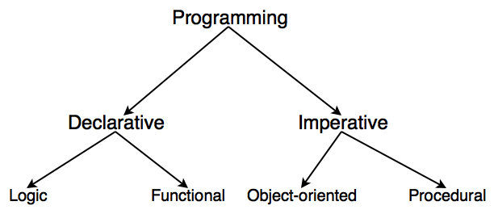

## 소프트웨어 공학

### 프로그래밍 패러다임



#### 선언적 프로그래밍 vs 명령형 프로그래밍

선언적 프로그래밍(declarative programming) : 무엇을 할 것인가가

    - 필요한 것을 달성하는 과정 하나하나 기술하는 것보다 필요한 것이 어떤 것인지 기술하는 데 방점을 두고 애플리케이션의 구조를 세워 나가는 프로그래밍 구조
    - 무엇(what)을 해야할지 프로그래밍 하는 것
    - 목표를 명시하고 알고리즘을 명시하지 않음
    - 프로그램이 함수형 프로그래밍 언어, 논리형 프로그래밍 언어 등의 언어로 작성된 경우
    - 선언형 프로그래밍 언어 : HTML, Lisp, Haskell, Prolog, SQL, XML ...
    - 장점: 가독성이나 재사용성이 좋고, 오류가 적음. 프로그램 동작을 변경하지 않고도 관련 값을 대체 할 수 있음.

    특징
    - 결과물에만 집중하고, 복잡한 과정은 추상화하여 신경쓰지 않는다.
    - 명령형의 경우 한 줄씩 읽어 나가면서 다음에 어떤 일이 발생할지 추측해야 한다. 반면에 선언형의 경우 자세한 방법을 모르더라도 코드만 보고도 어떤 일이 발생할지 예측이 단숨에 가능하다.
    - 따라서 선언형이 더 가독성이 좋으며 예측이 쉽다.
    - 선언형 코드는 사용자에게 편리함을 제공하는 대신 컴퓨터가 이해하지 못하기 때문에 변경해주는 작업이 필요하다. 하지만 이 또한 우리가 신경 쓸 영역이 아니다.

명령형 프로그래밍(imperative programming) : 어떻게 할 것인가

- 코드로 원하는 결과를 달성해 나가는 과정에만 관점을 두는 프로그래밍 스타일
- 어떻게(how) 행동해지 하지는지를 프로그래밍 하는 것
- 알고리즘을 명시하고 목표는 명시하지 않음
- 명령형 프로그래밍 언어: C, C++, Java, Pascal, Ruby ...

- 절차 지향 프로그래밍(Procedural Programming) : 순차적인 처리가 중요시

  - 장점 : 컴퓨터의 작업 처리 방식과 유사하여 객체지향 언어보다 처리가 빨라 시간적으로 유리
  - 단점 : 유지보수가 어려움. 실행 순서가 정해져있어 코드의 순서가 바뀌면 동일한 결과 보장 어려움
  - C언어

- 객체 지향 프로그래밍(Object Oriented Programming) : 프로그래밍에서 필요한 데이터를 추상화시켜 상태와 행위를 가진 객체를 만들고, 그 객체들 간의 유기적인 상호작용을 통해 로직을 구성하는 프로그래밍

  - 장점 : 유지보수가 쉬움. 코드 재사용이 용이. 대형 프로젝트에 적합
  - 단점 : 처리속도가 절차지향에 비해 느림. 객체가 많으면 용량이 커질 수 있음. 설계시 많은 시간과 노력 필요

  특징

  1. 클래스와 인스턴스(객체)
     클래스 : 어떤 문제를 해결하기 위한 데이터를 만들기 위해 추상화를 거쳐 집단에 속하는 속성(attritube)와 행위(behavior)를 변수와 메서드로 정의한 것
     인스턴스 : 클래스에서 정의한 것을 토대로 실제 메모리상에 할당된 것으로 실제 프로그램에서 사용되는 데이터
  2. 캡슐화(Encapsulation) = 정보 은닉
     데이터와 데이터를 처리하는 함수를 하나로 묶는 것. 캡슐화된 객체의 세부 내용이 외부에 은폐(정보 은닉)되어, 변경이 발생할 때 오류의 파급효과가 적다

     정보은닉 : 다른 객체에게 자신의 정보를 숨기고, 자신의 연산만을 통해 접근을 허용하는 것. private 키워드를 통해 외부에서 클래스 내부 정보에 접근하지 못하도록 하는 것

  3. 상속(Inheritance) = 재사용 + 확장

     상속 : 부모 클래스의 속성과 기능을 그대로 이어 받아 사용할 수 있게 하고 기능의 일부분을 변경해야 할 경우 상속 받은 자식클래스에서 해당 기능만 다시 수정하여 사용할 수 있게 한다(extends)

  4. 추상화(Abstraction) : 불필요한 정보는 숨기고 중요한 정보만을 표현함으로써 공통의 속성이나 기능을 묶어 이름을 붙이는 것

  5. 다형성(Polymorhism) : 하나의 객체가 여러 가지 타입을 가질 수 있는 것

  - 오버라이딩(Overriding)
  - 오버로딩(Overloading)

그 외의 혼합형 프로그래밍 언어: JS, C#, Python

예시1)

선언형 접근(WHAT): "2명 자리 주세요."

명령형 접근(HOW): "저기 Gone Fishin' 이라고 적힌 표지판 아래에 있는 테이블이 비어있네요.우리는 저기로 걸어가서 저 테이블에 앉도록 하겠습니다."

예시2) 모든 공백()을 하이픈(-)으로 바꾸는 함수

```
// 선언형 방식
const str = 'THIS IS SEUNG YEON'S TISTORY';
const res = str.replace(/ /g, '-');
console.log(res);
```

```
// 명령형 방식
const str = 'THIS IS SEUNG YEON'S TISTORY';
const res = '';

for (let i=0; i<str.length; i++) {
	if (str[i] === ' ') {
    	res += '-';
    } else {
    	res += str[i]
    }
}

console.log(res);
```

선언형 방식은 명령형 방식을 추상화 하는 것

#### 함수형 프로그래밍

자료처리를 수학적 함수의 계산으로 취급하고 상태와 가변 데이터를 멀리하는 프로그래밍 패러다임

함수형 프로그래밍 언어로 설계된 클로저,스칼라,하스켈 등의 언어가 있고, 자바스크립트,코틀린,파이썬 등에도 최근 버전에 함수형 프로그래밍 문법이 추가 되었다.

함수형 프로그래밍은 기존 절차적 프로그래밍과 객체 지향형 프로그래밍과는 다른 새로운 방식이다. 함수형 프로그래밍을 배우는 것은 스칼라나 클로저에 관심이 없고 앞으로 쓰지 않을 것 같다고 해도 다른 방식으로 사고하는 법을 배우는 것

함수형 프로그래밍은 명령형/객체지향 코드 보다 더 간결, 예측 가능하며 테스트하기 쉽다. 하지만 이에 익숙하지 않다면 훨씬 더 복잡해보일 수 있다!

특징

1. 순수함수 (Pure function)

- 동일한 입력에는 항상 같은 값을 반환해야 하는 함수
- 함수의 실행이 프로그램의 실행에 영향을 미치지 않아야 하는 함수
- 함수 내부에서 인자의 값을 변경하거나 프로그램 상태를 변경하는 Side Effect가 없는 것

  순수함수 : 반드시 하나의 인자를 받고, 받은 인자를 처리해서 동일한 결과물을 돌려주어야 한다. 인자를 제외한 다른 변수 사용X. 순수 함수는 프로그램의 변화 없이 입력 값에 대한 결과를 예상 할 수 있어 테스트가 용이하다.

2. 비상태, 불변성 (Stateless, Immutability)

- 함수형 프로그래밍에서의 데이터는 변하지 않는 불변성을 유지해야 한다.
- 데이터의 변경이 필요한 경우, 원본 데이터 구조를 변경하지 않고 그 데이터의 복사본을 만들어서 그 일부를 변경하고, 변경한 복사본을 사용해 작업을 진행한다.

3. 선언형 함수 (Expressions)
   명령형 프로그래밍은 무엇을 어떻게 할 것인가에 주목하고, 선언헌 프로그래밍은 무엇을 할 것인가에 주목한다.

   위의 예시에서는 for문을 사용해서 배열의 각 요소에 multiplier 곱해주는 명령형 프로그래밍이다.

   함수형 프로그래밍에서는 마찬가지로 if,switch,for 등 명령문을 사용하지 않고 함수형 코드로 사용해야한다.

   위의 예시는 for문을 map으로 대치했고, Javascript 에서는 filter,map,take,reduce 등의 함수형 코드를 사용한다. 명령형에서 함수형으로 변환하는 과정은 OPEN 투게더님 블로그을 참조해도 좋을 것 같다.

4. 1급 객체와 고차함수 (Fist-class, Higher-order functions)

함수형 프로그래밍에서는 함수가 1급 객체가 된다. 1급 객체의 특징은 다음과 같다.

- 변수나 데이터 구조안에 담을 수 있다.
- 파라미터로 전달 할 수 있다.
- 반환값(return value)으로 사용할 수 있다.
- 할당에 사용된 이름과 관계없이 고유한 구별이 가능하다.
- 동적으로 프로퍼티 할당이 가능하다.

그리고 고차 함수의 속성을 가져야 하는데, 고차 함수의 특징은 다음과 같다.

- 함수를 인자로써 전달 할 수 있어야 한다.
- 함수의 반환 값으로 또 다른 함수를 사용 할 수 있다

장단점

장점

- 높은 수준의 추상화를 제공한다
- 함수 단위의 코드 재사용이 수월하다
- 불변성을 지향하기 때문에 프로그램의 동작을 예측하기 쉬워진다

단점

- 순수함수를 구현하기 위해서는 코드의 가독성이 좋지 않을 수 있다
- 함수형 프로그래밍에서는 반복이 for문이 아닌 재귀를 통해 이루어지는데 (deep copy), 재귀적 코드 스타일은 무한 루프에 빠질 수 있다
- 순수함수를 사용하는 것은 쉬울 수 있지만 조합하는 것은 쉽지 않다
